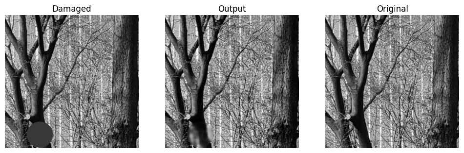

# 23101155 권민혁 프로젝트

## 문제 정의
본 프로젝트는 손상된 흑백 이미지를 복원하고, 색상화 하는 AI 경진대회였습니다. 제공받은 데이터셋을 CNN 기반의 인페인팅 모델로 손상 부분을 보완한 뒤, UNet 기반 색상화 모델로 인페인팅 된 흑백 이미지를 색상화하여 RGB 이미지로 복원합니다. 

## 코드 및 모델 구조 선택 배경
### 데이터셋 구성과 전처리
```
class DamagedImageDataset(Dataset):
    def __init__(self, csv_path, num_samples=None):
        """
        Args:
            csv_path: train.csv 파일 경로
            num_samples: 테스트용 샘플 수 (None이면 전체 데이터 사용)
        """
        # CSV 파일 읽기
        self.data = pd.read_csv(csv_path)
        if num_samples:
            self.data = self.data.head(num_samples)
            
        # 기본 디렉토리 경로 (csv 파일이 있는 디렉토리)
        self.root_dir = os.path.dirname(csv_path)
        
        # 손상된 이미지 전처리 (흑백화 적용)
        self.input_transform = transforms.Compose([
            transforms.Grayscale(num_output_channels=1),  # 흑백 변환
            transforms.ToTensor(),   # [0, 255] -> [0, 1]
            transforms.Normalize([0.5], [0.5])  # [0, 1] -> [-1, 1]
        ])

        # 원본 이미지 전처리 (색상 정보 유지)
        self.gt_transform = transforms.Compose([
            transforms.ToTensor(),   # [0, 255] -> [0, 1]
            transforms.Normalize([0.5], [0.5])  # [0, 1] -> [-1, 1]
        ])
        
    def __len__(self):
        return len(self.data)
        
    def __getitem__(self, idx):
        # 경로 가져오기
        input_path = os.path.join(self.root_dir, 
                                  self.data.iloc[idx]['input_image_path'].replace('./', ''))
        gt_path = os.path.join(self.root_dir, 
                               self.data.iloc[idx]['gt_image_path'].replace('./', ''))
        
        # 이미지 로드
        input_img = Image.open(input_path).convert("L")  # 손상된 입력 이미지 -> 흑백
        gt_img = Image.open(gt_path).convert("RGB")  # 원본 이미지 -> RGB
        
        # 전처리 적용
        input_tensor = self.input_transform(input_img)
        gt_tensor = self.gt_transform(gt_img)
        
        return input_tensor, gt_tensor
```
- csv 파일에 지정된 손상된 이미지 경로와 원본 이미지 경로를 통해 데이터셋을 구성합니다.
- 손상된 이미지는 흑백으로 읽어들여 [0.1] -> [-1,1] 범위로 정규화하고, 원본 이미지는 RGB 형식을 유지하면서 동일하게 정규화합니다.
- 텐서 형태로 변환하고, 스케일링을 통해 학습 안정성을 높였습니다.

### 인페인팅 모델 : ContextEncoder 기반
```
class Encoder(nn.Module):
    def __init__(self):
        super().__init__()
        self.encoder = nn.Sequential(
            # 입력: 1 x 512 x 512
            nn.Conv2d(1, 64, 4, stride=2, padding=1),    # 64 x 256 x 256
            nn.LeakyReLU(0.2),
            
            nn.Conv2d(64, 128, 4, stride=2, padding=1),  # 128 x 128 x 128
            nn.BatchNorm2d(128),
            nn.LeakyReLU(0.2),
            
            nn.Conv2d(128, 256, 4, stride=2, padding=1), # 256 x 64 x 64
            nn.BatchNorm2d(256),
            nn.LeakyReLU(0.2),
            
            nn.Conv2d(256, 512, 4, stride=2, padding=1), # 512 x 32 x 32
            nn.BatchNorm2d(512),
            nn.LeakyReLU(0.2),
            
            nn.Conv2d(512, 1024, 4, stride=2, padding=1), # 1024 x 16 x 16
            nn.BatchNorm2d(1024),
            nn.LeakyReLU(0.2),
        )
        
    def forward(self, x):
        return self.encoder(x)

class Decoder(nn.Module):
    def __init__(self):
        super().__init__()
        self.decoder = nn.Sequential(
            # 입력: 1024 x 16 x 16
            nn.ConvTranspose2d(1024, 512, 4, stride=2, padding=1), # 512 x 32 x 32
            nn.BatchNorm2d(512),
            nn.ReLU(),
            
            nn.ConvTranspose2d(512, 256, 4, stride=2, padding=1),  # 256 x 64 x 64
            nn.BatchNorm2d(256),
            nn.ReLU(),
            
            nn.ConvTranspose2d(256, 128, 4, stride=2, padding=1),  # 128 x 128 x 128
            nn.BatchNorm2d(128),
            nn.ReLU(),
            
            nn.ConvTranspose2d(128, 64, 4, stride=2, padding=1),   # 64 x 256 x 256
            nn.BatchNorm2d(64),
            nn.ReLU(),
            
            nn.ConvTranspose2d(64, 1, 4, stride=2, padding=1),     # 1 x 512 x 512
            nn.Tanh()
        )
        
    def forward(self, x):
        return self.decoder(x)

class ContextEncoder(nn.Module):
    def __init__(self):
        super().__init__()
        self.encoder = Encoder()
        self.decoder = Decoder()
        
    def forward(self, x):
        features = self.encoder(x)
        output = self.decoder(features)
        return output
```
- 이미지 복원에서 Context Encoder는 손상된 이미지에서 손실된 부분 주변 맥락을 이해하여 복원합니다.
- Encoder-Decoder 형태의 아키텍처를 사용하여, Encoder는 입력 이미지의 저차원 잠재 표현을 추출하고, Decoder는 이 표현을 다시 복원하는 형태로 진행됩니다. 이 구조를 통해 이미지 내 글로벌 컨텍스트를 이해하고, 손실 영역을 자연스럽게 채웁니다.
- Encoder : 여러 단계의 Conv-BN-LeakyReLU로 구성되어 입력 이미지를 압축합니다.
  - LeakyReLU는 정보 손실을 줄이고, BatchNorm은 학습 안정성을 높여 네트워크가 다양한 조명 및 품질에서 더 안정적으로 수렴하도록 돕습니다.
- Decoder : ConvTranspose를 이용해 잠재공간을 다시 이미지 크기까지 복원하여, Tanh를 사용해 출력 픽셀을 [-1.1] 범위에 맞춥니다.
- 흑백 이미지 복원에 최적화된 이 구조를 먼저 학습하여, 결손된 부분을 메우고 전체적인 형태를 복원하는 데 활용합니다.

### 색상화 모델 - UNet 기반
```
class UNetBlock(nn.Module):
    def __init__(self, in_channels, out_channels, down=True, bn=True, dropout=False):
        super().__init__()
        
        layers = []
        if down:
            layers.append(nn.Conv2d(in_channels, out_channels, 4, 2, 1, bias=False))
        else:
            layers.append(nn.ConvTranspose2d(in_channels, out_channels, 4, 2, 1, bias=False))
            
        if bn:
            layers.append(nn.BatchNorm2d(out_channels))
            
        layers.append(nn.LeakyReLU(0.2) if down else nn.ReLU())
        
        if dropout:
            layers.append(nn.Dropout(0.5))
            
        self.block = nn.Sequential(*layers)
        
    def forward(self, x):
        return self.block(x)

class Colorizer(nn.Module):
    def __init__(self):
        super().__init__()
        
        # Encoder
        self.enc1 = UNetBlock(3, 64, bn=False)  # 256
        self.enc2 = UNetBlock(64, 128)          # 128
        self.enc3 = UNetBlock(128, 256)         # 64
        self.enc4 = UNetBlock(256, 512)         # 32
        self.enc5 = UNetBlock(512, 512)         # 16
        self.enc6 = UNetBlock(512, 512)         # 8
        self.enc7 = UNetBlock(512, 512)         # 4
        self.enc8 = UNetBlock(512, 512)         # 2
        
        # Decoder, Skip-Connection 사용
        self.dec1 = UNetBlock(512, 512, down=False, dropout=True)    # 4
        self.dec2 = UNetBlock(1024, 512, down=False, dropout=True)   # 8
        self.dec3 = UNetBlock(1024, 512, down=False, dropout=True)   # 16
        self.dec4 = UNetBlock(1024, 512, down=False)                 # 32
        self.dec5 = UNetBlock(1024, 256, down=False)                 # 64
        self.dec6 = UNetBlock(512, 128, down=False)                  # 128
        self.dec7 = UNetBlock(256, 64, down=False)                   # 256
        
        # Final layer
        self.final = nn.Sequential(
            nn.ConvTranspose2d(128, 3, 4, 2, 1),
            nn.Tanh()
        )
        
    def forward(self, x):
        # Encoder
        e1 = self.enc1(x)
        e2 = self.enc2(e1)
        e3 = self.enc3(e2)
        e4 = self.enc4(e3)
        e5 = self.enc5(e4)
        e6 = self.enc6(e5)
        e7 = self.enc7(e6)
        e8 = self.enc8(e7)
        
        # Decoder, Skip-Connection 사용
        d1 = self.dec1(e8)
        d2 = self.dec2(torch.cat([d1, e7], 1))
        d3 = self.dec3(torch.cat([d2, e6], 1))
        d4 = self.dec4(torch.cat([d3, e5], 1))
        d5 = self.dec5(torch.cat([d4, e4], 1))
        d6 = self.dec6(torch.cat([d5, e3], 1))
        d7 = self.dec7(torch.cat([d6, e2], 1))
        
        return self.final(torch.cat([d7, e1], 1))
```
- 복원된 흑백 이미지를 RGB로 확장한 뒤, UNet 모델로 색상화를 수행했습니다.
- UNet은 인코더에서 계층적으로 특징을 추출하고, 디코더에서 Skip-Connection을 활용하여 저해상도 특징과 고해상도 특성을 결합하여 세밀한 색상 정보를 복원할 수 있습니다.
- Skip-Connection 사용 이유 :
  - 인코더에서 추출된 추상화된 특징만으로는 섬세한 색상 복원이 어려울 수 있으나, 저레벨 특징 맵을 디코더 단계에 다시 결합하여 공간적 정보와 패턴을 유지할 수 있습니다. 이를 통해 디테일과 자연스러운 색상 분포를 재현합니다.
- Dropout : 일부 디코더 단계에 Dropout을 사용하여 과적합을 방지하고, 일반화 성능을 향상시켰습니다.

### 통합 모델
```
class RestoreAndColorize(nn.Module):
    def __init__(self, restore_model):
        super().__init__()
        self.restore_model = restore_model
        self.colorize_model = Colorizer()
        
    def forward(self, x):
        with torch.no_grad():
            restored = self.restore_model(x)  # 1채널 출력
        restored_rgb = restored.repeat(1, 3, 1, 1)  # 1채널 -> 3채널로 확장
        colorized = self.colorize_model(restored_rgb)  # 색상화 모델에 전달
        return restored, colorized


# 기존 복원 모델 로드 및 가중치 고정
restore_model = ContextEncoder()
restore_model.load_state_dict(torch.load('results/best_model.pth',weights_only=True))
restore_model.eval()
for param in restore_model.parameters():
    param.requires_grad = False

# 통합 모델 생성
model = RestoreAndColorize(restore_model)
```
- 우선 `restore_model`(ContextEncoder)로 흑백 손상 이미지를 인페인팅하여 복원했습니다. 복원 모델만 따로 학습 후 파라미터를 고정하여 추후 학습에 참여하지 않고 복원 성능을 유지하도록 했습니다.
- 복원된 1채널 이미지를 3채널로 확장하고, UNet기반 `colorize_model`로 전달하여 색상화를 수행합니다.
- 이렇게 단계적으로 처리하는 방식을 활용해 이미지 손상 복구와 색상 복원을 별도로 해결하고, 복원된 이미지를 그대로 활용하여 더욱 안정적이고 자연스러운 색상 복원이 이루어지도록 했습니다.

### 이미지 저장
```
def save_images(damaged, output, original, epoch, save_dir='results'):
    if not os.path.exists(save_dir):
        os.makedirs(save_dir)
        
    # 첫 번째 이미지에 대해서만 저장 (배치 중 하나 선택)
    def process_image(img):
        img = img.cpu().detach().numpy()  # Tensor → NumPy
        if img.shape[0] == 1:  # 1채널(흑백)
            img = img.squeeze(0)  # CxHxW → HxW
            img = np.expand_dims(img, axis=-1)  # HxW → HxW1
            img = np.tile(img, (1, 1, 3))  # HxW1 → HxW3 (RGB로 확장)
        else:  # 3채널(RGB)
            img = img.transpose(1, 2, 0)  # CxHxW → HxWxC
        img = (img * 0.5 + 0.5).clip(0, 1)  # 정규화 해제
        return img

    damaged_np = process_image(damaged[0])
    output_np = process_image(output[0])
    original_np = process_image(original[0])
    
    # 이미지 플롯 및 저장
    fig, axes = plt.subplots(1, 3, figsize=(12, 4))
    axes[0].imshow(damaged_np)
    axes[0].set_title('Damaged')
    axes[0].axis('off')
    
    axes[1].imshow(output_np)
    axes[1].set_title('Output')
    axes[1].axis('off')
    
    axes[2].imshow(original_np)
    axes[2].set_title('Original')
    axes[2].axis('off')
    
    # 이미지 파일로 저장
    save_path = os.path.join(save_dir, f'epoch_{epoch}.png')
    plt.savefig(save_path, bbox_inches='tight')
    plt.close(fig)
```
- 손상된 이미지, 모델의 출력, 원본 이미지를 한 줄에 나란히 시각화하여 훈련 진행 상황을 모니터링할 수 있게 해주는 함수입니다.
- 첫 번째 이미지만 선택해 3채널(RGB) 형태로 변환한 뒤, 정규화를 해제하고 matplotlib으로 시각화합니다.
- 결과 이미지를 result 폴더에 현재 에포크 번호를 파일명에 포함하여 .png 형식으로 저장합니다.

### 설정 클래스
```
@dataclass
class ModelConfig:
    # 모델 아키텍처 설정
    input_channels: int = 1
    output_channels: int = 1
    initial_features: int = 64
    latent_dim: int = 1024
    image_size: int = 512

@dataclass
class TrainConfig:
    # 학습 관련 설정
    num_epochs: int = 100        
    batch_size: int = 32         
    learning_rate: float = 0.0002  
    beta1: float = 0.5          
    beta2: float = 0.999        
    num_workers: int = 4        
    
    # 저장 관련 설정
    results_dir: str = 'results'
    save_frequency: int = 100   
    print_frequency: int = 50   

@dataclass
class Config:
    model: ModelConfig = field(default_factory=ModelConfig)
    train: TrainConfig = field(default_factory=TrainConfig)
    device: torch.device = field(default_factory=lambda: torch.device('cuda' if torch.cuda.is_available() else 'cpu'))
    
    def __post_init__(self):
        # 필요한 디렉토리 생성
        os.makedirs(self.train.results_dir, exist_ok=True)

# 설정 객체 생성
config = Config()
```
- 학습 과정에 필요한 주요 하이퍼파라미터와 디렉토리 경로를 묶어서 관리할 수 있도록 설정 클래스를 만들었습니다.
- ModelConfig : 모델 구조와 관련된 입력 채널 수, 이미지 크기, 잠재 차원 등을 설정하여 저장합니다.
- TrainConfig : 학습과 관련된 에포크 수, 배치 크기, 학습률 등을 설정하여 저장합니다.

### 학습
```
def train(model, train_loader, val_loader, criterion, optimizer, device, config):
    model.train()
    best_val_loss = float('inf')
    
    for epoch in range(config.train.num_epochs):
        # 학습 단계
        model.train()
        total_train_loss = 0
        
        progress_bar = tqdm(enumerate(train_loader), total=len(train_loader), 
                          desc=f"Train Epoch {epoch+1}/{config.train.num_epochs}")
        
        for batch_idx, (damaged, original) in progress_bar:
            damaged = damaged.to(device)
            original = original.to(device)
    
            # 원본 이미지가 1채널이면 3채널로 확장
            if original.shape[1] == 1:
                original = original.repeat(1, 3, 1, 1)

            optimizer.zero_grad()
            restored, colorized = model(damaged)  # 모델 출력
    
            # 손실 계산
            loss = criterion(colorized, original)  # colorized와 original 모두 3채널6-
            loss.backward()
            optimizer.step()

            total_train_loss += loss.item()
            progress_bar.set_postfix(loss=f"{loss.item():.4f}")

    
            if batch_idx % config.train.save_frequency == 0:
                save_images(damaged, colorized, original,  # colorized를 저장
                            epoch=epoch, 
                            save_dir=config.train.results_dir)

        
        avg_train_loss = total_train_loss / len(train_loader)
        
        # 검증 단계
        model.eval()
        total_val_loss = 0
        
        with torch.no_grad():
            for damaged, original in val_loader:
                damaged = damaged.to(device)
                original = original.to(device)

                if original.shape[1] == 1:
                    original = original.repeat(1, 3, 1, 1)

        restored, colorized = model(damaged)
        val_loss = criterion(colorized, original)
        total_val_loss += val_loss.item()

        
        avg_val_loss = total_val_loss / len(val_loader)
        
        print(f'Epoch [{epoch+1}/{config.train.num_epochs}]')
        print(f'Training Loss: {avg_train_loss:.4f}')
        print(f'Validation Loss: {avg_val_loss:.4f}')
        
        # 최적의 모델 저장
        if avg_val_loss < best_val_loss:
            best_val_loss = avg_val_loss
            torch.save({
                'restore_model': model.restore_model.state_dict(),
                'colorize_model': model.colorize_model.state_dict()
            }, os.path.join(config.train.results_dir, 'best_colorize_model.pth'))

def main():
    # 설정 로드
    config = Config()
    device = config.device
    print(f'Using device: {device}')
    
    # 전체 데이터셋 생성
    full_dataset = DamagedImageDataset('data/train.csv', num_samples=10000)
    
    # 학습/검증 데이터 분할 (80:20)
    train_size = int(0.8 * len(full_dataset))
    val_size = len(full_dataset) - train_size
    
    train_dataset, val_dataset = random_split(
        full_dataset, 
        [train_size, val_size],
        generator=torch.Generator().manual_seed(42)
    )
    
    # 데이터로더 생성
    train_loader = DataLoader(
        train_dataset,
        batch_size=config.train.batch_size,
        shuffle=True,
        num_workers=config.train.num_workers
    )
    
    val_loader = DataLoader(
        val_dataset,
        batch_size=config.train.batch_size,
        shuffle=False,
        num_workers=config.train.num_workers
    )

    # 모델 초기화 수정
    model = RestoreAndColorize(restore_model).to(device)  
    criterion = nn.L1Loss() 
    optimizer = Adam(
        model.colorize_model.parameters(),  
        lr=config.train.learning_rate,
        betas=(config.train.beta1, config.train.beta2)
    )
    
    # 학습 시작
    train(model, train_loader, val_loader, criterion, optimizer, device, config)

if __name__ == '__main__':
    main()
```
- 매 에포크마다 학습 데이터셋을 반복하며 모델을 학습시키고, 손실 값을 통해 모델의 성능 변화를 확인합니다.
- 학습 후에는 검증 데이터셋으로 모델 성능을 평가하며, 검증 손실이 개선될 때 최적의 모델 가중치를 저장합니다.
- 메인 함수에서 데이터셋을 로드하고, 모델, 손실함수, 옵티마이저를 초기화하고 train 함수를 호출하여 모델을 학습합니다.

## 진행 과정
본 프로젝트는 손상된 흑백 이미지를 복원한 뒤, 복원한 이미지를 색상화하는 두 단계로 진행했습니다.

### 1. 컨텍스트 인코더를 이용한 복원
컨텍스트 인코더를 사용하여 손상된 영역 주변 맥락을 바탕으로 복구했습니다. 복원된 이미지는 손상 부분이 채워진 흑백 이미지입니다.



### 2. UNet을 이용한 색상화
복원된 흑백 이미지를 UNet 모델을 사용하여 RGB 이미지로 색상화했습니다. 이를 통해 원본 이미지와 유사한 색채 정보를 복원했습니다.


