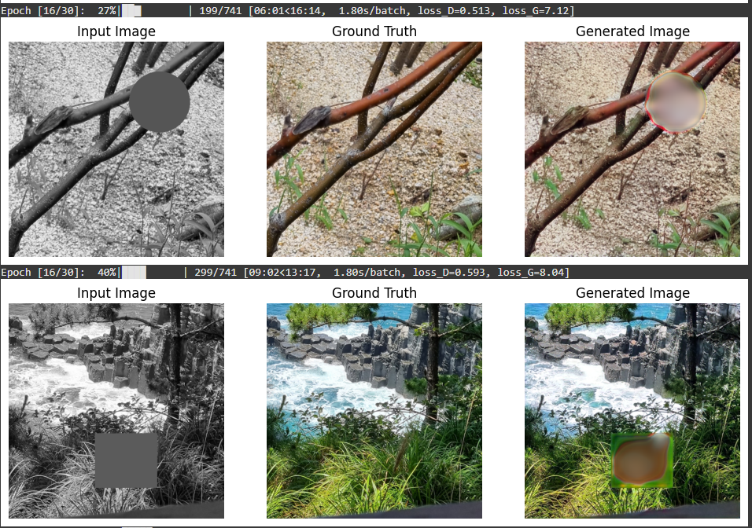
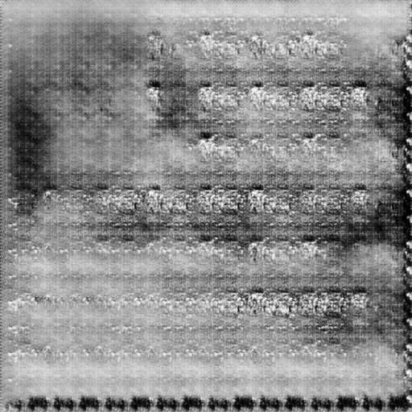
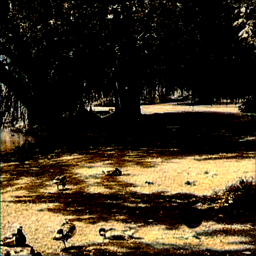
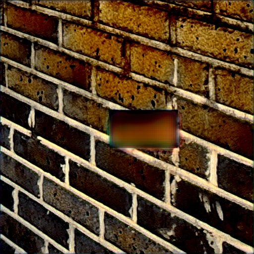
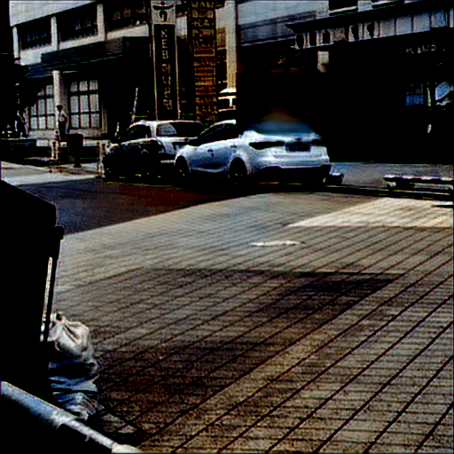
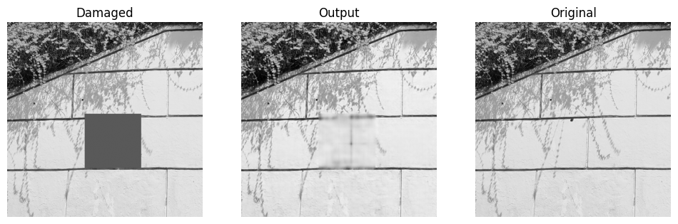

# 프로젝트 보고서

## 팀원별 문제 해결 전략 및 결과

우리 팀은 이번 프로젝트를 통해 각자의 고유한 문제 해결 전략과 모델을 사용하여 다양한 방식으로 문제를 해결하고자 하였습니다. 팀원 각각은 독창적인 접근 방식을 선택하였으며, 이를 통해 서로 다른 결과물을 도출할 수 있었습니다. 이러한 과정을 통해 우리는 팀 내에서 협업과 공유의 중요성을 다시 한번 실감하게 되었습니다.

---

### 1. 최동주 - GAN 기반 접근

**프로젝트 링크**: [최동주 프로젝트](https://github.com/ml-study-seoultech/ml-project/tree/dove9441)

최동주는 **GAN(Generative Adversarial Network)**을 기반으로 손상된 이미지를 복원하고 컬러화하는 모델을 구현하였습니다. GAN은 생성자(Generator)와 판별자(Discriminator) 간의 적대적 학습을 통해 점진적으로 손상된 이미지를 자연스럽게 복원하고 컬러를 채워 넣는 방식입니다.

- **전략**: GAN의 생성자는 손상된 이미지를 복원하고, 판별자는 복원된 이미지가 실제와 얼마나 유사한지 평가합니다. 이를 반복적으로 학습하여 생성자는 더욱 정교한 이미지를 복원하게 됩니다.
- **결과**: 흑백 이미지를 컬러 이미지로 변환하는 데 있어 혁신적인 결과를 도출하였으나, 학습 데이터와 모델 구조의 제약으로 인해 일부 세부 영역에서 복원 성능의 한계가 드러났습니다.
- **개선 방향**: 손실 함수와 모델 안정화를 중점적으로 개선하여 학습 과정을 최적화하였습니다.

---

### 2. 안태우 - U-Net 기반 FullPipeline 모델

**프로젝트 링크**: [안태우 프로젝트](https://github.com/ml-study-seoultech/ml-project/tree/antaewoo)

안태우는 **U-Net 기반의 FullPipeline 모델**을 설계하여 문제를 해결하였습니다. 그의 접근법은 세 단계로 구성되었습니다.

1. **Mask Detection**: 손상된 영역을 정확히 감지.
2. **Inpainting**: 손상된 영역을 복원.
3. **Colorization**: 복원된 이미지를 컬러화.

- **전략**: 각 단계에서 U-Net 아키텍처를 활용하여 안정적이고 신뢰할 수 있는 결과물을 생성.
- **결과**: 손상 영역 복원에서는 우수한 성능을 보였으나, 컬러화 과정에서는 일부 색상 표현에서 부자연스러운 결과가 발생.
- **개선 방향**: 학습 데이터를 확장하고 손실 함수를 개선하며 컬러화 과정을 고도화.

---

### 3. 권민혁 - ContextEncoder와 UNet 기반 색상화 모델 통합

**프로젝트 링크**: [권민혁 프로젝트](https://github.com/ml-study-seoultech/ml-project/tree/ellocani)

권민혁은 **ContextEncoder와 UNet 기반 색상화 모델을 통합한 하이브리드 방식**을 도입하여 문제를 해결하였습니다.

1. **ContextEncoder**: 손상된 영역을 복원. 이미지의 맥락 정보를 활용하여 복원 결과 생성.
2. **UNet 기반 Colorizer**: 복원된 이미지를 컬러화. Skip-Connection을 활용해 섬세한 색상 복원을 수행.

- **전략**: 두 모델을 유기적으로 연결하여 손상 영역 복원과 컬러화를 단계적으로 처리.
- **결과**: 손상 영역 복원과 컬러화 모두에서 안정적인 성능을 보였으며, 결과물이 상당히 자연스러움.
- **개선 방향**: 두 모델 간의 유기적 연결을 통해 더욱 자연스러운 복원과 컬러화를 목표로 함.

---

## 다양한 관점에서 문제 해결 방법을 볼 수 있어서 좋았다

우리 팀은 각 팀원이 서로 다른 전략과 모델을 통해 문제를 해결하며, 다양한 관점에서 문제를 탐구할 수 있었습니다. 이러한 과정은 팀의 역량을 극대화하는 데 크게 기여하였습니다. 

1. **다양성**: 각자 독창적인 방법론을 시도하여 다양한 결과물을 도출.
2. **공유와 학습**: 각자의 방법론과 결과물을 공유함으로써 서로의 접근법을 더욱 고도화.
3. **결과**: 서로 다른 강점을 가진 모델을 통해 문제 해결의 다각적 접근이 가능했음.

---

## 결론

이번 프로젝트는 단순히 문제를 해결하는 데 그치지 않고, 각자의 학습 과정과 경험을 공유하며 함께 성장하는 기회였습니다. 이를 통해 **다양한 관점의 중요성**과 **협력의 가치**를 확인할 수 있었습니다. 

이러한 경험은 향후 다양한 문제를 해결하는 데 큰 자산이 될 것이라 확신합니다.

아래는 앞서 말한 3명의 보고서들 입니다. 자세한 내용이 포함되어있습니다.

---

# 21101234 최동주

# Problem

## Loss image recovering

- Loss(masked)된 부분이 있는 흑백 이미지로부터 원본 컬러 이미지 복원
- Specific Task : Computer Vision - **MIM : Masked Image Modeling / Coloring / Inpainting**

Contest link : [https://dacon.io/competitions/official/236420/overview/description](https://dacon.io/competitions/official/236420/overview/description)

# Dataset

### Structure

```markdown
open/
│
├── train_input/         # Train data 
│   ├── TRAIN_00000.png  # 29603 512x512 masked grayscale image
│   ├── TRAIN_00001.png
│   ├── TRAIN_00002.png
│   └── ...
│
├── train_gt/            # Train_target data (Ground Truth)
│   ├── TRAIN_00000.png  # 29603 512x512 original colored image
│   ├── TRAIN_00001.png
│   ├── TRAIN_00002.png
│   └── ...
│
├── test_input/          # Test data
│   ├── TEST_00000.png   # 100 512x512 masked grayscale image
│   ├── TEST_00001.png
│   ├── TEST_00002.png
│   └── ...
│
├── train.csv             # triain_input / train_gt image path
└── test.csv             # test_input image path
```

## Sample Data


# First approach : GAN

생성적 적대 생성망 GAN(Generative Adversarial Network)


GAN은 이미지를 만들어내는 Generator와, 이를 판별하는 Discriminator로 구별됨.

Generator는 실제(now train_gt)와 같은 이미지를 생성하려 하고, Discriminator는 실제 이미지와 생성된 이미지를 구분하려고 한다. 이러한 적대적 학습을 통해 Generator는 점점 더 실제와 유사한 이미지를 생성할 수 있게 된다.

첫 번째 시도는 GAN이 mask 부분 복구와 coloring을 동시에 수행하는 것을 목표로 함.

## Process overview

1. 입력이 train_input(masked grayscale image)인 Generator 정의.
2. Generator가 mask 영역 복원 및 coloring을 동시 수행
3. Discriminator가 train_gt(원본 이미지)와 비교해서 판별
4. Loss 바탕으로 Generator는 더 train_gt와 같은 이미지를 생성하게 됨

### Generator

```python
# Generator
class GeneratorUNet(nn.Module):
    def __init__(self):
        super(GeneratorUNet, self).__init__()
        self.model = smp.Unet(
            encoder_name="resnet34",
            encoder_weights="imagenet", # pre-trained weight 사용
            in_channels=1, # train_input은 흑백 이미지
            classes=3, # 생성할 이미지는 컬러(3채널)
        )

    def forward(self, x):
        return self.model(x)

```

### U-net


Ronneberger, O., Fischer, P., & Brox, T. (2015). *U-Net: Convolutional networks for biomedical image segmentation*. In *International Conference on Medical Image Computing and Computer-Assisted Intervention* (pp. 234–241). Springer, Cham.

U-net은 CNN을 이용한 Encoder-decoder 모델로, 이미지를 압축된 형태로 encoding 후 다시 원래 크기로 복원하는 구조를 가짐.  Encoder→Decoder의 layer를 직접 연결하는 skip connection을 사용하여 세부 정보의 손실을 방지하고, gradient vanishing 문제를 완화하는 특징이 있어 GAN에 자주 사용되는 것으로 알려져 있음.

인코더로 pre-trained된 resnet을 사용함.

또한 중요한 이유로, dataset image 크기가 512 x 512인데, pre-trained resnet34의 기본 입력 크기는 224 x 224 ****이지만 U-net은 FCN(Fully Convolution Network)이므로 따로 resize하지 않아도 알아서 입출력이 크기에 맞게 잘 동작하므로, U-net을 사용함.

 

### Discriminator

```python
# Discriminator
class Discriminator(nn.Module):
    def __init__(self, in_channels=3):
        super(Discriminator, self).__init__()
        self.model = nn.Sequential(
            nn.Conv2d(in_channels, 64, kernel_size=4, stride=2, padding=1),
            nn.LeakyReLU(0.2, inplace=True),

            nn.Conv2d(64, 128, kernel_size=4, stride=2, padding=1),
            nn.BatchNorm2d(128),
            nn.LeakyReLU(0.2, inplace=True),

            nn.Conv2d(128, 256, kernel_size=4, stride=2, padding=1),
            nn.BatchNorm2d(256),
            nn.LeakyReLU(0.2, inplace=True),

            nn.Conv2d(256, 1, kernel_size=4, stride=1, padding=0),
            nn.Sigmoid() # Discriminator는 binary classifier이다
        )

    def forward(self, x):
        return self.model(x)

```

Disciminator는 Generator가 생성한 이미지가 원본과 동일한지 판별한다.

`nn.Conv2d(in_channels, 64, kernel_size=4, stride=2, padding=1),`

`nn.LeakyReLU(0.2, inplace=True)`

4x4 filter, stride 2, zero-padding(keras에서는 ‘same’) 으로 다운샘플링.

LeakyReLU로 gradient vanish 완화, α=0.2(x<0에서), inplace=True는 pytorch에서 텐서를 직접 수정할 수 있게 해서(복사 후 수정된 텐서 반환이 아닌) 메로리를 절약할 수 있음.

`nn.Conv2d(64, 128, kernel_size=4, stride=2, padding=1),
nn.BatchNorm2d(128),
nn.LeakyReLU(0.2, inplace=True),`

중간에 Batch Nomalization으로 training 안정화

`nn.Conv2d(256, 1, kernel_size=4, stride=1, padding=0),
nn.Sigmoid()` 

출력층에서, Discriminator는 binary classifier이므로 sigmoid를 사용한다.

### Loss

`Generator loss = adversarial_loss + (100*pixelwise_loss)`  (scale 맞추기 위해 x100)

`Discriminator loss = (loss_D_real + loss_D_fake)/2`  

| **모델** | **손실 구성 요소** | **목표** | **손실 함수** |
| --- | --- | --- | --- |
| **Generator** | Adversarial Loss  | Discriminator가 생성된 이미지를 **1**로 판별 | Binary Cross Entropy (BCE) |
|  | Pixelwise Loss  | 생성 이미지와 실제 이미지(train_gt)와 픽셀 값이 유사하게 | L1 Loss (절댓값 오차) |
| **Discriminator** | Real Image Loss (Loss_D_read) | 진짜 이미지(train_gt)를 **1**로 판별 | Binary Cross Entropy (BCE) |
|  | Fake Image Loss (Loss_D_fake) | 가짜 이미지(생성된 이미지)를 **0**으로 판별 | Binary Cross Entropy (BCE) |

**label(train_gt) = 1, label(generator_generated_image) = 0으로 설정**

---

### Other setting

- 이미지 증강을 사용하려고 했었으나 기존 이미지만 해도 학습 시간이 너무 오래 걸리는 바람에 사용하지 못함
- 본래 AgementedDataset이라는 이름으로, train_gt에서 랜덤 위치를 masking한 후 흑백으로 변경해서, 이것 또한 학습에 사용하려고 함
- GAN은 원래 학습이 불안정하기 때문에 early stopping을 사용하지 않고 꽤 많은 epoch를 돌린 후, tensorboard에 기록된 로그를 보고 최적의 모델을 찾고자 했음. 3epoch마다 checkpoint를 저장함.
- 

## Entire Training code

```python
# 코랩 환경에서 google drive 연동
from google.colab import drive
drive.mount('/content/drive')

### Unzip

# 이미 압축 풀었으면 삭제하기 위함 (/content/dataset은 코랩 instance 실행 중에만 접근 가능함)
!rm -rf /content/dataset

# 구글 드라이브에 압축 풀린 파일 전체를 올려서 하면 로드 속도가 너무 느려서, instance 실행 중에 생성되는 저장공간에 압축 풀어서 로드하면 훨씬 빠르다
!unzip -qq /content/drive/MyDrive/MLProject/open.zip -d /content/dataset/
# -qq : verbose=False

# 라이브러리 import
import random
import pandas as pd
import numpy as np
import os
import cv2
import torch
import torch.nn as nn
import torch.optim as optim
from torch.utils.data import Dataset, DataLoader, ConcatDataset
from torchvision import transforms
import albumentations as A
from albumentations.pytorch import ToTensorV2
!pip install segmentation_models_pytorch
import segmentation_models_pytorch as smp
from tqdm import tqdm
import matplotlib.pyplot as plt
from PIL import Image
import warnings
warnings.filterwarnings(action='ignore')
!pip install scikit-image
# 대회에서 평가지표가 ssim이다
from skimage.metrics import structural_similarity as ssim

# 디바이스 설정
device = torch.device('cuda') if torch.cuda.is_available() else torch.device('cpu')

### Hyperparameter setting

CFG = {
    'IMG_SIZE':512, # 원래 이미지 크기도 512*512
    'EPOCHS':30,
    'BATCH_SIZE':32,
    'SEED':41
}

### Fix seed

# 시드 고정
def seed_everything(seed):
  # Python의 기본 난수 생성기 시드 설정
  random.seed(seed)  # random 모듈에서 생성되는 난수들을 고정시키기 위해 시드 설정
  # Python 해시 시드 설정 (파이썬의 해시 기반 객체 비교 등에 영향을 미친다고 함)
  os.environ['PYTHONHASHSEED'] = str(seed)  # 환경 변수로 설정된 해시 시드 값 고정
  # NumPy의 난수 생성기 시드 설정
  np.random.seed(seed)
  # PyTorch의 CPU 난수 생성기 시드 설정
  torch.manual_seed(seed)
  # PyTorch의 GPU 난수 생성기 시드 설정 (CUDA)
  torch.cuda.manual_seed(seed)
  # cudnn 연산 결과가 결정적(항상 같게)
  torch.backends.cudnn.deterministic = True  # True로 설정하면 cudnn 연산이 결정적으로 동작
  # cudnn에서 연산 속도가 빨라진다고 함
  torch.backends.cudnn.benchmark = True

seed_everything(CFG['SEED'])

# train_input, train_gt 이미지 경로가 매핑되어있는 csv 파일 로드
df = pd.read_csv('/content/dataset/train.csv')
df # 한번 보기

### Dataset Split

# 데이터셋 분할
df = df.sample(frac=1).reset_index(drop=True)
data_size = len(df)
train_ratio = 0.8 # train set : 80% / validation set : 20%로 분할 (배포용이 아니므로 test set은 안함)

# train set과 validation set크기 계산
train_size = int(data_size * train_ratio)
val_size = data_size - train_size

# 데이터셋 분할
train_df = df.iloc[:train_size]
val_df = df.iloc[train_size:]

# 확인용 출력
print(f"Train size: {len(train_df)}")
print(f"Validation size: {len(val_df)}")
print(f"Total size: {len(train_df) + len(val_df)}")

## Dataset Define

class OriginalDataset(Dataset):
    def __init__(self, df, transforms=None):
        self.df = df.reset_index(drop=True)
        self.transforms = transforms

    # pytorch dataset class의 필수 메서드들

    def __len__(self): # custom 객체에 len(object) 했을 때 반환할 값
        return len(self.df) # dataset instance 개수 반환

    # pytorch에서 instance를 로드할 때 이 메서드를 사용함, 객체를 인덱스로 접근 가능하게
    def __getitem__(self, idx):
        base_path = '/content/dataset'
        # train.csv에는 ./train_input/TRAIN_00000.png 이런 식으로 있다
        # 이미지 경로 얻기 위한 전처리
        input_image_rel_path = self.df.loc[idx, 'input_image_path'].lstrip('./')
        gt_image_rel_path = self.df.loc[idx, 'gt_image_path'].lstrip('./')

        input_image_path = os.path.join(base_path, input_image_rel_path)
        gt_image_path = os.path.join(base_path, gt_image_rel_path)

        # 이미지 로드
        input_image = Image.open(input_image_path).convert('L')  # 흑백 이미지
        gt_image = Image.open(gt_image_path).convert('RGB')      # 컬러 이미지

        # 이미지 전처리
        if self.transforms:
            input_image = self.transforms['input'](input_image)
            gt_image = self.transforms['gt'](gt_image)

        return input_image, gt_image

### Transform

# 이미지 전처리 (범위를 [-1,1]로 만들면 0 기준 대칭이기 때문에 활성화함수를 쓸 때 안정적이다)
original_input_transform = transforms.Compose([
    transforms.ToTensor(), # ToTensor 수행 시 [0,255] -> [0,1]로 바뀜
    transforms.Normalize(mean=[0.5], std=[0.5]) # 이러면 [0,1] -> [-1,1]로 바뀜
])

original_gt_transform = transforms.Compose([
    transforms.ToTensor(),
    transforms.Normalize(mean=[0.5, 0.5, 0.5], std=[0.5, 0.5, 0.5])
])

original_transforms = {
    'input': original_input_transform,
    'gt': original_gt_transform
}

## Create Dataset

# 데이터셋 생성
original_dataset = OriginalDataset(train_df, transforms=original_transforms)

print(f"Original dataset size: {len(original_dataset)}")

## Dataloader

# train dataloader
train_loader = DataLoader(original_dataset, batch_size=CFG['BATCH_SIZE'], shuffle=True)

# validation Dataloader
val_dataset = OriginalDataset(val_df, transforms=original_transforms)
val_loader = DataLoader(val_dataset, batch_size=CFG['BATCH_SIZE'], shuffle=False)

### GAN Model define

# Generator
class GeneratorUNet(nn.Module):
    def __init__(self):
        super(GeneratorUNet, self).__init__()
        self.model = smp.Unet(
            encoder_name="resnet34", # 인코더로 resnet34 사용
            encoder_weights="imagenet", # pre-trained 가중치 로드
            in_channels=1, # train_input은 흑백 이미지이므로
            classes=3, # generator가 생성할 이미지는 컬러 이미지이므로
        )

    def forward(self, x):
        return self.model(x)

# Discriminator
class Discriminator(nn.Module):
    def __init__(self, in_channels=3):
        super(Discriminator, self).__init__()
        self.model = nn.Sequential(
            nn.Conv2d(in_channels, 64, kernel_size=4, stride=2, padding=1),
            nn.LeakyReLU(0.2, inplace=True),

            nn.Conv2d(64, 128, kernel_size=4, stride=2, padding=1),
            nn.BatchNorm2d(128),
            nn.LeakyReLU(0.2, inplace=True),

            nn.Conv2d(128, 256, kernel_size=4, stride=2, padding=1),
            nn.BatchNorm2d(256),
            nn.LeakyReLU(0.2, inplace=True),

            nn.Conv2d(256, 1, kernel_size=4, stride=1, padding=0),
            # binary classifier이다
            nn.Sigmoid()
        )

    def forward(self, x):
        return self.model(x)

## Loss Function & Optimizer

# 손실 함수 및 옵티마이저 설정
adversarial_loss = nn.BCELoss() # binary crossentropy
pixelwise_loss = nn.L1Loss() # abs(실제값 - 예측값)

generator = GeneratorUNet().to(device) # GPU로 모델 옮기기
discriminator = Discriminator().to(device)

# Generator는 Discriminator 피드백을 기반으로 학습하기 때문에 Dicriminator가 학습이 더 빨리 되는 것이 좋다고 한다
optimizer_G = optim.Adam(generator.parameters(), lr=1e-4, betas=(0.5, 0.999)) # Adam optimizer는 b1, b2가 있음(Momentum + RMSProp), Adam이 가장 보편적
optimizer_D = optim.Adam(discriminator.parameters(), lr=2e-4, betas=(0.5, 0.999))

## Train

!pip install pytorch-msssim

from pytorch_msssim import ssim  # GPU에서 SSIM 계산을 위한 라이브러리
from tqdm import tqdm  # progress bar 표시 tqdm

# SSIM 계산을 위한 메서드 ssim 계산하려면 denormalize 해야함
def denormalize(tensor, mean, std):
    tensor = tensor.clone()
    for t, m, s in zip(tensor, mean, std):
        t.mul_(s).add_(m) # (x-mean)/std를 반대로
    return tensor

# validation
def validate(generator, dataloader):
    # validation에는 generator만 있으면 된다
    generator.eval()
    total_ssim = 0.0
    with torch.no_grad(): # validate, inference에는 그래디언트가 필요없음
        for input_image, gt_image in tqdm(dataloader, desc='Validation', unit='batch'):
            input_image = input_image.to(device)
            gt_image = gt_image.to(device)

            gen_output = generator(input_image)

            # Denormalize , [0,1] 범위 만들기
            gen_output_denorm = (gen_output * 0.5) + 0.5
            gt_image_denorm = (gt_image * 0.5) + 0.5

            # Denormalize 했을 때 [0,1] 범위를 벗어나지 않게 하기
            gen_output_denorm = torch.clamp(gen_output_denorm, 0, 1)
            gt_image_denorm = torch.clamp(gt_image_denorm, 0, 1)

            # SSIM 계산 (GPU 사용)
            ssim_value = ssim(gen_output_denorm, gt_image_denorm, data_range=1.0, size_average=True)
            total_ssim += ssim_value.item() * input_image.size(0)  # 배치 크기를 곱하여 총 SSIM 누적

    # 평균 SSIM 계산
    avg_ssim = total_ssim / len(dataloader.dataset)
    return avg_ssim

## Train & Validation

# 체크포인트 불러오기
checkpoint = torch.load('/content/drive/MyDrive/MLProject/saved/GAN/checkpoints/checkpoint_epoch30.pth')

#모델 불러오기
generator.load_state_dict(checkpoint['generator_state_dict'])
discriminator.load_state_dict(checkpoint['discriminator_state_dict'])

#optimizer 불러오기
optimizer_G.load_state_dict(checkpoint['optimizer_G_state_dict'])
optimizer_D.load_state_dict(checkpoint['optimizer_D_state_dict'])

# epoch 정보 불러오기
#start_epoch = checkpoint['epoch'] + 1  # 다음 에포크부터 시작

#print(f"Start training epoch : {start_epoch}")

from torch.utils.tensorboard import SummaryWriter

# 로그 저장 디렉토리 설정
log_dir = '/content/drive/MyDrive/MLProject/saved/GAN/logs'
writer = SummaryWriter(log_dir=log_dir)

# GPU 메모리 비우기
import gc
gc.collect()
torch.cuda.empty_cache()

# Train
# Generator가 생성한 것은 가짜 이미지, train_gt는 진짜 이미지
real_label = 1.0
fake_label = 0.0

for epoch in range(CFG['EPOCHS']):
    generator.train()
    discriminator.train()
    running_loss_G = 0.0
    running_loss_D = 0.0

    train_loader_tqdm = tqdm(train_loader, desc=f"Epoch [{epoch+1}/{CFG['EPOCHS']}]", unit="batch")

    for batch_idx, (input_image, gt_image) in enumerate(train_loader_tqdm):
        input_image = input_image.to(device)
        gt_image = gt_image.to(device)

        batch_size = input_image.size(0)

        # 연산 시 차원 맞추기 위해서 크기 늘려주는것
        real_labels = torch.full((batch_size, 1, 1, 1), real_label, device=device)
        fake_labels = torch.full((batch_size, 1, 1, 1), fake_label, device=device)

        ####### Train Generator #######
        optimizer_G.zero_grad() #optimizer step 후 그래디언트 리셋

        gen_output = generator(input_image)

        pred_fake = discriminator(gen_output)

        # 레이블 크기를 pred_fake와 동일하게 생성
        real_labels = torch.ones_like(pred_fake, device=device)

        # Generator는 Discriminator가 진짜 이미지로 분류하게 하는 이미지를 생성하는 것이 목표.
        # Generator Loss는, Discriminator가 판별한 값 <->  1(실제 이미지는 레이블이 1이다) 사이의 loss(binary crossentropy)이다
        loss_G_adv = adversarial_loss(pred_fake, real_labels)

        # 픽셀 수준 loss로, 생성된 이미지와 ground truth 간의 픽셀값 차이에 대한 loss()
        loss_G_pixel = pixelwise_loss(gen_output, gt_image)

        loss_G = loss_G_adv + 100 * loss_G_pixel # 총 Generator loss는 adv_loss와 pixel loss의 합으로(scale 맞추기 위해서 *100)

        loss_G.backward() # 역전파
        optimizer_G.step() # optization

        ####### Train Discriminator #######
        optimizer_D.zero_grad()

        pred_real = discriminator(gt_image) # Discriminator가 train_gt를 진짜로 판별하도록 결과값 저장

        # 레이블 크기를 pred_real과 동일하게 생성
        real_labels = torch.ones_like(pred_real, device=device)

        loss_D_real = adversarial_loss(pred_real, real_labels) # Discriminator가 평가한 train_gt <-> 1 사이의 loss, Discriminator는 train_gt를 1(진짜)로 판별하도록 학습되어야 한다

        pred_fake = discriminator(gen_output.detach()) #discriminator(gen_output.detach()): gen_output.detach()는 Generator의 출력을 계산에서 분리하여, Discriminator가 Generator의 영향을 받지 않도록 합니다. 가짜 이미지에 대한 예측을 평가합니다.

        # 레이블 크기를 pred_fake와 동일하게 생성
        fake_labels = torch.zeros_like(pred_fake, device=device)

        loss_D_fake = adversarial_loss(pred_fake, fake_labels) #  Discriminator가 평가한 generator가 생성한 이미지 <-> 0 사이의 loss, generator가 생성한 이미지는 0으로 판별하도록 학습되어야 한다.

        loss_D = (loss_D_real + loss_D_fake) / 2 # 두 loss 평균을 총 Discriminator Loss로

        loss_D.backward()
        optimizer_D.step()

        running_loss_G += loss_G.item()
        running_loss_D += loss_D.item()

        # loss_G=2.345 이런 식으로 progress bar에 표시
        train_loader_tqdm.set_postfix(loss_G=loss_G.item(), loss_D=loss_D.item())

        # TensorBoard에 batch당 loss 기록
        step = epoch * len(train_loader) + batch_idx
        writer.add_scalar('Loss/Generator', loss_G.item(), step)
        writer.add_scalar('Loss/Discriminator', loss_D.item(), step)

        # 100개의 batch 처리마다 출력으로 간단히 보여주기
        if (batch_idx + 1) % 100 == 0:
            input_img = denormalize(input_image[0].cpu(), mean=[0.5], std=[0.5]) # 각 batch 중 첫 번째 이미지 선택
            gt_img = denormalize(gt_image[0].cpu(), mean=[0.5]*3, std=[0.5]*3)
            output_img = denormalize(gen_output[0].detach().cpu(), mean=[0.5]*3, std=[0.5]*3) #[0.5]*3은 [0.5, 0.5, 0.5]랑 같음

            input_img = input_img.squeeze()
            input_img = torch.clamp(input_img, 0, 1)
            gt_img = torch.clamp(gt_img.permute(1, 2, 0), 0, 1) # PLT에서 쓰기 위해 (channel, height, width)를 (height, width, channel)로 바꿔줌
            output_img = torch.clamp(output_img.permute(1, 2, 0), 0, 1)

            plt.figure(figsize=(12, 4))
            plt.subplot(1, 3, 1)
            plt.imshow(input_img, cmap='gray')
            plt.title('Input Image')
            plt.axis('off')

            plt.subplot(1, 3, 2)
            plt.imshow(gt_img)
            plt.title('Ground Truth')
            plt.axis('off')

            plt.subplot(1, 3, 3)
            plt.imshow(output_img)
            plt.title('Generated Image')
            plt.axis('off')

            plt.show()
    # checkpoint 저장 (3 epoch당)
    if epoch % 3 == 0:
      checkpoint = {
          'epoch': epoch,
          'generator_state_dict': generator.state_dict(),
          'discriminator_state_dict': discriminator.state_dict(),
          'optimizer_G_state_dict': optimizer_G.state_dict(),
          'optimizer_D_state_dict': optimizer_D.state_dict(),
      }
      checkpoint_save_path = f'/content/drive/MyDrive/MLProject/saved/GAN/checkpoints/checkpoint_epoch{epoch+1}.pth'
      torch.save(checkpoint, checkpoint_save_path)

    epoch_loss_G = running_loss_G / len(train_loader)
    epoch_loss_D = running_loss_D / len(train_loader)
    print(f"Epoch [{epoch+1}/{CFG['EPOCHS']}], Generator Loss: {epoch_loss_G:.4f}, Discriminator Loss: {epoch_loss_D:.4f}")

    # TensorBoard에 에포크별 손실 기록
    writer.add_scalar('Epoch Loss/Generator', epoch_loss_G, epoch)
    writer.add_scalar('Epoch Loss/Discriminator', epoch_loss_D, epoch)

    # 검증 및 SSIM 계산
    avg_ssim = validate(generator, val_loader)
    print(f"Validation SSIM: {avg_ssim:.4f}")

# 학습 종료 후 SummaryWriter 닫기
writer.close()

## Inference
import os
import torch
from PIL import Image
from torchvision import transforms
from tqdm import tqdm
import zipfile
import pandas as pd

# 디바이스 설정 (GPU 사용 가능하면 GPU 사용)
device = torch.device('cuda' if torch.cuda.is_available() else 'cpu')

# 체크포인트 불러오기
checkpoint = torch.load('/content/drive/MyDrive/MLProject/saved/GAN/checkpoints/checkpoint_epoch30.pth')

#모델 상태 불러오기
generator.load_state_dict(checkpoint['generator_state_dict'])
discriminator.load_state_dict(checkpoint['discriminator_state_dict'])

# 테스트 데이터프레임 로드
test_df = pd.read_csv('/content/drive/MyDrive/MLProject/test.csv')

# 테스트 이미지 경로와 결과 저장 경로 설정
base_path = '/content/drive/MyDrive/MLProject/MAT'  # 이미지 파일이 저장된 기본 경로
output_dir = '/content/output_images'
os.makedirs(output_dir, exist_ok=True)

# 입력 이미지에 대한 변환 정의 (학습 시 사용한 것과 동일하게)
input_transform = transforms.Compose([
    transforms.ToTensor(),
    transforms.Normalize(mean=[0.5], std=[0.5])
])

# 출력 이미지를 저장하기 위한 함수
def tensor_to_pil(tensor):
    # Denormalize
    tensor = tensor.squeeze(0).cpu().clone()
    tensor = tensor * 0.5 + 0.5  # [-1,1] -> [0,1]
    tensor = torch.clamp(tensor, 0, 1)
    # Tensor에서 PIL 이미지로 변환
    #tensor = tensor.permute(1, 2, 0)  # (C, H, W) -> (H, W, C)
    print(tensor.shape)
    image = transforms.ToPILImage()(tensor)
    return image

# Inference
generator.eval()
i=0
with torch.no_grad():
    for idx in tqdm(range(len(test_df)), desc='Inference'):
        # 테스트 데이터프레임에서 이미지 경로 가져오기
        input_image_rel_path = test_df.loc[idx, 'input_image_path'].lstrip('./')
        input_image_path = os.path.join(base_path, input_image_rel_path)
        filename = os.path.basename(input_image_path)

        # 입력 이미지 로드 및 전처리
        input_image = Image.open(input_image_path).convert('L')
        # 이미지 크기를 512x512로 조정 (필요한 경우)
        # 변환 적용
        input_tensor = input_transform(input_image).unsqueeze(0).to(device)

        # Generator를 통해 출력 이미지 생성
        gen_output = generator(input_tensor)
        # 출력 텐서를 PIL 이미지로 변환
        output_image = tensor_to_pil(gen_output)
        # 결과 이미지 저장
        output_path = os.path.join(output_dir, filename)
        output_image.save(output_path)
        if i < 10:
          plt.figure(figsize=(12, 4))
          plt.subplot(1, 2, 1)
          plt.imshow(input_image, cmap='gray')
          plt.title('Input Image')
          plt.axis('off')

          plt.subplot(1, 2, 2)
          plt.imshow(output_image)
          plt.title('Generated Image')
          plt.axis('off')

          plt.show()
          i = i + 1
# 결과 이미지들을 ZIP 파일로 압축 (제출용)
zip_filename = '/content/drive/MyDrive/MLProject/saved/GAN/GAN_30epoch_output.zip'
with zipfile.ZipFile(zip_filename, 'w') as zipf:
    for filename in sorted(os.listdir(output_dir)):
        if filename.endswith('.png'):
            file_path = os.path.join(output_dir, filename)
            zipf.write(file_path, arcname=filename)

# TensorBoard 로드 및 실행
%load_ext tensorboard
%tensorboard --logdir /content/drive/MyDrive/MLProject/saved/GAN/logs

torch.save(checkpoint, '/content/drive/MyDrive/MLProject/saved/GAN/checkpoints/checkpoint_epoch30.pth')
```

### Training Review




Training 하면서 보니, 색칠은 그럭저럭 잘 되는 것 같은데 mask recovering이 잘 되지 않는 것으로 보였다. Tensorboard를 보니 학습은 매우 불안정했지만 Generator loss는 계속 감소했기 때문에, 이미지 증강을 통한 더 많은 데이터, 더 많은 반복 학습을 통하면 더 개선될 수 있지 않았을까 생각한다.

# Second approach : MAT(MIM) + GAN(coloring)

Papers With Code에서, 채우기만 전문으로 학습된 모델이 없을까 찾아보았는데, 

](./images/image%204.png)

[https://paperswithcode.com/task/image-inpainting#datasets](https://paperswithcode.com/task/image-inpainting#datasets)

그중 공개되어 있으며 모델 크기가 학습에 적당하고 성능도 CelebA-HQ Dataset에서 1등으로 괜찮다고 생각되고, 무엇보다 학습 데이터가 512*512로 이번 데이터셋과 동일한,  MAT: Mask-Aware Transformer for Large Hole Image Inpainting 모델을 사용하기로 함. 또한 이번에는 흑백 사진에서 mask된 영역만 복구한 후에, 이미 학습한 GAN으로 coloring하는 방법을 시도함.

### MAT: Mask-Aware Transformer for Large Hole Image Inpainting


기존 접근법(CNN 기반 모델, 트랜스포머 기반 모델)은 한계를 가진다고 함.

1. **CNN 기반 모델**: 근거리 정보에 집중하며, 복잡한 구조를 복원하는 데 한계가 있음.
2. **트랜스포머 기반 모델**: 계산 비용 문제로 인해 저해상도에서만 작동, 세부 정보 복원이 부족함.

위 논문에서 위와 같은 새로운 모델 구조와, Transfomer Block(TB)를 제안하는데, 차이점은 다음과 같음.

1. **Layer Normalization 제거** : large scale mark에서 gradient exploding 문제와, 정규화 과정에서 쓸모없는 토큰들임에도 확대(정규화니까)하는 문제가 있었음
    
    *we observe unstable optimization using the general block when handling large-scale
    masks, sometimes incurring gradient exploding. We attribute this training issue to the large ratio of invalid tokens (their values are nearly zero). In this circumstance, layer normalization may magnify useless tokens overwhelmingly, leading to unstable training(원문)*
    
2. **Residual connection → Feature concatenation 변경**
    
    초기에 masked 부분이 많은 상태에서 base 없이 residual connection을 써봤자 의미가 없다는 것
    
    *residual learning generally encourages the model to learn high-frequency contents. However, considering most tokens are invalid at the beginning, it is difficult to directly learn high-frequency details without proper low-frequency basis in GAN training, which makes the optimization harder(원문)*
    
    - 또한 transformer block 내에서만 사용했던 residual connection을, Conv layer와 연결되는 Global Residual connection을 사용했다고 함.
    
3.  **Style Manipulation Module :** CNN weight에 ****noise 주입으로 다양한 표현을 생성할 수 있게 함
    
    
4. **Multi-Head-Attention → Multi-Head Contextual Attention** 
- Multi-Head Attention (기존 transformer):
    - 전체 입력 토큰에 대해 Attention 계산
- **Multi-Head Contextual Attention (MCA):**
    
    
    

- 입력 토큰을 고정된 크기의 window로 나눈 뒤, 각 window 내에서만 attention 계산 수행, attention 수행 후 window 이동시키기 (w*w size에서  $(⌊
w/
2
⌋, ⌊
w/
2
⌋) pixel$ 이동한다고 함)
- 이는 계산 효율성을 높이고 (일부에 대해서만 계산하면 되기 떄문에), 지역적(local) 및 장거리(global) 관계를 점진적으로 모델링할 수 있게 함.

- **Mask Updating Strategy :  valid token끼리만 attention 계산하기 위함**
    - *default attention strategy not only fails to borrow visible
    information to inpaint the holes, but also undermines the effective valid pixels* (원문)
    - 기존 attention 계산을 사용하면 Missing area가 많을수록 missing area의 정보도 계산에 사용하기 때문에 좋지 않다고 함


$τ$는 매우 큰 자연수. Foward step에서 Mask는 업데이트되는데, 규칙은 다음과 같음.

- window 내에 적어도 하나의 valid token이 존재하면, window 내 모든 token이 valid로 업데이트
- window 내 모든 토큰이 invalid인 경우, 그대로 invalid로 남음.

Transformer block 차이점 정리

| **특징** | **기존 Transformer Block** | **Adjusted Transformer Block** |
| --- | --- | --- |
| **Layer Normalization** | 사용 | 제거 (학습 안정성 확보) |
| **Residual Learning** | **Residual connection** | Feature Concatenation으로 변경 (저주파수 기반 학습) |
| **Positional Embedding** | 사용 | 생략 (3×3  ConV layer로 대체, 경험적으로 위치정보를 제공하는데 충분했다고 함) |
| **Attention Method** | Multi-Head-Attention | Multi-Head Contextual Attention  |

---

## MAT + GAN Training

### MAT을 이용한 Inpainting (grayscale → grayscale)

- mask된 흑백 이미지에서 손실 영역만 복구하는 과정.
- 논문에서 공개된, https://github.com/fenglinglwb/mat([https://github.com/fenglinglwb/mat](https://github.com/fenglinglwb/mat)) 모델 사용

1. **TRAIN_input에 대한 mask 생성 → mask를 생성하는 모델 만들기**
- MAT 모델은 검은색으로 마스킹된 부분에 대해서만 inpainting작업을 수행한다.  따라서 train_input에서 어떤 부분이 mask되었는지 판별하여, 그 부분에 대해서만 검은색으로 색칠된  mask image가 필요


- Train 이미지의 masking 영역은 완전한 검은색 또는 회색 등 일정한 색이 아니다.
    
    → YOLO 등 기존 Image segementaion model 사용 불가, 비슷한 색이면 mask로 인식해버린다
    
     
    
- 어떻게 train_input에서 masked area를 파악할 것인가? → train_input과 train_gt(흑백으로 변환)를 비교해서, 다른 부분을 $y_{target}$으로 설정. 이를 기반으로 image segmentation 모델 만들기
- train_input이  train_X, mask(단순 픽셀비교를 통해 다른 부분이 검은색으로 칠해진 이미지)가 정답값이 되는 것

- Image Sementaion 모델은 U-net 사용, target_y는 Dataset class에서 직접 생성
- Loss는`criterion = nn.BCEWithLogitsLoss()` 를 사용했는데, U-net의 마지막 출력층에 sigmoid가 적용되지 않아서 출력이 0~1의 확률값이 아니어도 BCELoss를 계산할 수 있게 해준다.
- 또한 이 Image Segmentation Model은 Pixel 단위 이진 분류(mask인지 아닌지)를 수행하기 때문에, BCE Loss를 사용하는 것이 적절하다.

```python
# Dataset
class SegmentationDataset(Dataset):
    def __init__(self, input_dir, gt_dir, transforms=None):
        self.input_dir = input_dir
        self.gt_dir = gt_dir
        self.transforms = transforms

        # 이미지 파일 목록 가져오기
        self.input_images = sorted(glob(os.path.join(self.input_dir, '*')))
        self.gt_images = sorted(glob(os.path.join(self.gt_dir, '*')))

    def __len__(self):
        return len(self.input_images)

    def __getitem__(self, idx):
        # 이미지 경로
        input_image_path = self.input_images[idx]
        gt_image_path = self.gt_images[idx]

        # 이미지 로드 및 흑백으로 변환
        input_image = Image.open(input_image_path).convert('L')
        gt_image = Image.open(gt_image_path).convert('L')  # 컬러 이미지를 흑백으로 변환

        # numpy 배열로 변환
        input_array = np.array(input_image)
        gt_array = np.array(gt_image)

        # 세그멘테이션 마스크 생성
        # 마스킹된 영역: 0, 나머지 영역: 1 (train_input과 train_gt가 같으면 검은색(0) 다르면 흰색(1)
        mask = (input_array == gt_array).astype(np.float32)

        # 변환 적용
        if self.transforms:
            input_image = self.transforms['input'](input_image)
            mask = self.transforms['mask'](mask)
				
				#input_image가 train_X, mask가 target_y(정답값)이 되는 것
        return input_image, mask|
```

## Entire Training Code

```python
from google.colab import drive
drive.mount('/content/drive')

#!unzip -qq /content/drive/MyDrive/MLProject/train_dataset.zip -d /content/dataset/
!mkdir -p /content/dataset/
!unzip -qq /content/drive/MyDrive/MLProject/open.zip -d /content/dataset/train_dataset/

import os
print(len(os.listdir('/content/drive/MyDrive/MLProject/MAT/masks')))
print(len(os.listdir('/content/dataset/train_dataset/train_input')))

## MASK 생성

import os
import numpy as np
from PIL import Image
from glob import glob
from tensorboard import SummaryWriter
import torch
import torch.nn as nn
import torch.optim as optim
from torch.utils.data import Dataset, DataLoader, random_split
from torchvision import transforms
from tqdm import tqdm

# Colab에서 TensorBoard를 사용하기 위한 설정
%load_ext tensorboard

# Pre-trained 되지 않은 U-net
class UNet(nn.Module):
    def __init__(self, in_channels=1, out_channels=1): # 흑백 이미지에서 흑백 마스크만 생성하는 것이므로 입출력 채널은 1 
        super(UNet, self).__init__()
        # Convolution-BatchNormalization-ReLU
        def CBR(in_channels, out_channels):
            return nn.Sequential(
                nn.Conv2d(in_channels, out_channels, kernel_size=3, padding=1),
                nn.BatchNorm2d(out_channels),
                nn.ReLU(inplace=True)
            )

        self.enc1 = CBR(in_channels, 64)
        self.pool1 = nn.MaxPool2d(2)

        self.enc2 = CBR(64, 128)
        self.pool2 = nn.MaxPool2d(2)

        self.enc3 = CBR(128, 256)
        self.pool3 = nn.MaxPool2d(2)

        self.enc4 = CBR(256, 512)
        self.pool4 = nn.MaxPool2d(2)

        self.bottleneck = CBR(512, 1024)

        # 디코더
        self.upconv4 = nn.ConvTranspose2d(1024, 512, kernel_size=2, stride=2)
        self.dec4 = CBR(1024, 512)

        self.upconv3 = nn.ConvTranspose2d(512, 256, kernel_size=2, stride=2)
        self.dec3 = CBR(512, 256)

        self.upconv2 = nn.ConvTranspose2d(256, 128, kernel_size=2, stride=2)
        self.dec2 = CBR(256, 128)

        self.upconv1 = nn.ConvTranspose2d(128, 64, kernel_size=2, stride=2)
        self.dec1 = CBR(128, 64)

        # 출력 레이어
        self.conv_last = nn.Conv2d(64, out_channels, kernel_size=1)

    def forward(self, x):
        # 인코더
        enc1 = self.enc1(x)
        pool1 = self.pool1(enc1)

        enc2 = self.enc2(pool1)
        pool2 = self.pool2(enc2)

        enc3 = self.enc3(pool2)
        pool3 = self.pool3(enc3)

        enc4 = self.enc4(pool3)
        pool4 = self.pool4(enc4)

        bottleneck = self.bottleneck(pool4)

        # 디코더
        up4 = self.upconv4(bottleneck)
        up4 = torch.cat([up4, enc4], dim=1)
        dec4 = self.dec4(up4)

        up3 = self.upconv3(dec4)
        up3 = torch.cat([up3, enc3], dim=1)
        dec3 = self.dec3(up3)

        up2 = self.upconv2(dec3)
        up2 = torch.cat([up2, enc2], dim=1)
        dec2 = self.dec2(up2)

        up1 = self.upconv1(dec2)
        up1 = torch.cat([up1, enc1], dim=1)
        dec1 = self.dec1(up1)

        # 출력
        out = self.conv_last(dec1)
        return out

# 7. 디바이스 설정
device = torch.device('cuda' if torch.cuda.is_available() else 'cpu')

# 모델 초기화
model = UNet(in_channels=1, out_channels=1)
model = model.to(device)

# 데이터 경로 설정
train_x_path = '/content/dataset/train_dataset/train_input'
label_y_path = '/content/dataset/train_dataset/train_gt'

# Dataset
class SegmentationDataset(Dataset):
    def __init__(self, input_dir, gt_dir, transforms=None):
        self.input_dir = input_dir
        self.gt_dir = gt_dir
        self.transforms = transforms

        # 이미지 파일 목록 가져오기
        self.input_images = sorted(glob(os.path.join(self.input_dir, '*')))
        self.gt_images = sorted(glob(os.path.join(self.gt_dir, '*')))

    def __len__(self):
        return len(self.input_images)

    def __getitem__(self, idx):
        # 이미지 경로
        input_image_path = self.input_images[idx]
        gt_image_path = self.gt_images[idx]

        # 이미지 로드 및 흑백으로 변환
        input_image = Image.open(input_image_path).convert('L')
        gt_image = Image.open(gt_image_path).convert('L')  # 컬러 이미지를 흑백으로 변환

        # numpy 배열로 변환
        input_array = np.array(input_image)
        gt_array = np.array(gt_image)

        # 세그멘테이션 마스크 생성
        # 마스킹된 영역: 0, 나머지 영역: 1 (train_input과 train_gt가 같으면 검은색(0) 다르면 흰색(1)
        mask = (input_array == gt_array).astype(np.float32)

        # 변환 적용
        if self.transforms:
            input_image = self.transforms['input'](input_image)
            mask = self.transforms['mask'](mask)

        return input_image, mask

# 데이터 변환 설정
input_transform = transforms.Compose([
    transforms.ToTensor(),
    transforms.Normalize(mean=[0.5], std=[0.5])
])

mask_transform = transforms.Compose([
    transforms.Lambda(lambda x: torch.from_numpy(x).unsqueeze(0))
])

# 데이터셋 및 데이터로더 생성
# 전체 데이터셋 로드
full_dataset = SegmentationDataset(
    input_dir=train_x_path,
    gt_dir=label_y_path,
    transforms={'input': input_transform, 'mask': mask_transform}
)

# 데이터셋을 8:2 비율로 분할
train_size = int(0.8 * len(full_dataset))
val_size = len(full_dataset) - train_size

train_dataset, val_dataset = random_split(full_dataset, [train_size, val_size])
# 데이터로더 생성
batch_size = 16

train_loader = DataLoader(train_dataset, batch_size=batch_size, shuffle=True)
val_loader = DataLoader(val_dataset, batch_size=batch_size, shuffle=False)

import gc
gc.collect()
torch.cuda.empty_cache()

# TensorBoard 로그를 저장할 디렉토리 설정
log_dir = '/content/drive/MyDrive/MLProject/MAT/tensorboard_logs'

# SummaryWriter 생성
writer = SummaryWriter(log_dir=log_dir)

# 손실 함수 및 옵티마이저 설정
criterion = nn.BCEWithLogitsLoss()
optimizer = optim.Adam(model.parameters(), lr=1e-4)

num_epochs = 3

for epoch in range(num_epochs):
    model.train()
    running_loss = 0.0
    train_loader_tqdm = tqdm(train_loader, desc=f"Epoch [{epoch+1}/{num_epochs}]", unit="batch")

    for batch_idx, (input_image, mask) in enumerate(train_loader_tqdm):
        input_image = input_image.to(device)
        mask = mask.to(device)

        optimizer.zero_grad()

        outputs = model(input_image)

        loss = criterion(outputs, mask)

        loss.backward()
        optimizer.step()

        running_loss += loss.item()

    epoch_loss = running_loss / len(train_loader)
    print(f'Epoch [{epoch+1}/{num_epochs}], Training Loss: {epoch_loss:.4f}')

    # TensorBoard에 기록
    writer.add_scalar('Loss/train', epoch_loss, epoch)

    # validation
    model.eval()
    val_loss = 0.0
    with torch.no_grad():
        for input_image, mask in tqdm(val_loader):
            input_image = input_image.to(device)
            mask = mask.to(device)

            outputs = model(input_image)
            loss = criterion(outputs, mask)

            val_loss += loss.item()

    val_loss /= len(val_loader)
    print(f'Epoch [{epoch+1}/{num_epochs}], Validation Loss: {val_loss:.4f}')

    # TensorBoard에 검증 손실 기록
    writer.add_scalar('Loss/val', val_loss, epoch)

    # 모델 저장 (선택 사항)
    torch.save(model.state_dict(), f'/content/drive/MyDrive/MLProject/MAT/maskGen/unet_epoch_{epoch+1}.pth')

# TensorBoard Writer 닫기
writer.close()

import os
import matplotlib.pyplot as plt
from PIL import Image

device = torch.device('cuda' if torch.cuda.is_available() else 'cpu')

# 모델 로드
model = UNet(in_channels=1, out_channels=1)
model.load_state_dict(torch.load('/content/drive/MyDrive/MLProject/MAT/maskGen/unet_epoch_3.pth'))
model = model.to(device)

# Train_image에 대해 mask를 생성
def inference(model, image_path, device):
    model.eval()
    with torch.no_grad():
        input_image = Image.open(image_path).convert('L') # 이미 흑백이므로 안 해도 됨

        input_tensor = transforms.ToTensor()(input_image)
        input_tensor = transforms.Normalize(mean=[0.5], std=[0.5])(input_tensor)
        input_tensor = input_tensor.unsqueeze(0).to(device)

        output = model(input_tensor)
        output = torch.sigmoid(output)
        output = output.squeeze().cpu().numpy()

        # 모델 출력값이 0.5 이상이면 흰색으로 칠하기 위해
        threshold = 0.5
        binary_mask = (output > threshold).astype(np.uint8)

        # 마스크 이미지 생성
        mask_image = Image.fromarray(binary_mask * 255)

        return mask_image

from tqdm import tqdm
# 마스크 이미지를 저장할 디렉토리 설정
#output_dir = '/content/drive/MyDrive/MLProject/MAT/masks'
output_dir = '/content/drive/MyDrive/MLProject/tast_output_masks'
# 디렉토리가 존재하지 않으면 생성
if not os.path.exists(output_dir):
    os.makedirs(output_dir)

# 입력 이미지 디렉토리 설정
#input_dir = '/content/dataset/train_dataset/train_input'
input_dir = '/content/drive/MyDrive/MLProject/test_input'
i=0
# 추론 및 결과 시각화 및 저장
for img_name in tqdm(os.listdir(input_dir)):
    #print(f"Processing: {img_name}")
    test_image_path = os.path.join(input_dir, img_name)
    predicted_mask = inference(model, test_image_path, device)

    # 마스크 이미지 저장 경로 설정
    mask_save_path = os.path.join(output_dir, f"mask_{img_name}")

    # 마스크 이미지 저장
    predicted_mask.save(mask_save_path)

    # 원본 이미지 로드
    original_image = Image.open(test_image_path).convert('L')

    # 결과 시각화
    if i < 5:
      plt.figure(figsize=(10, 5))

      plt.subplot(1, 2, 1)
      plt.imshow(original_image, cmap='gray')
      plt.title('Input Image')
      plt.axis('off')

      plt.subplot(1, 2, 2)
      plt.imshow(predicted_mask, cmap='gray')
      plt.title('Predicted Mask')
      plt.axis('off')

      plt.show()
      i = i + 1
```


3번의 epoch로 꽤 정확히 mask 영역이 검은색으로 칠해진 mask 이미지를 생성할 수 있었다. 하지만 완벽히 정확하지는 않다.


1. **Train_input 전체에 대해 mask 생성**


위 모델을 통해 모든 이미지에 대해 mask를 생성하였다.

1. **MAT를 이용하여 Inpainting 수행**

```python
!git  clone https://github.com/fenglinglwb/MAT.git /content/drive/MyDrive/MLProject/MAT
!pip install -r /content/drive/MyDrive/MLProject/MAT/requirements.txt
!python /content/drive/MyDrive/MLProject/MAT/generate_image.py --network /content/drive/MyDrive/MLProject/MAT/CelebA-HQ_512.pkl --dpath /content/dataset/train_dataset/train_input --outdir /content/drive/MyDrive/MLProject/MAT/sample_ouput --mpath /content/drive/MyDrive/MLProject/MAT/masks
```

논문에서 공개한 모델을 이용하여 Inpainting을 수행함. 해당 github 링크에서 자세한 사용법이 나와있음.


1. **이전에 학습한 GAN을 이용하여 coloring**

```python
import os
import torch
from PIL import Image
from torchvision import transforms
from tqdm import tqdm
import zipfile
import pandas as pd

# 디바이스 설정 (GPU 사용 가능하면 GPU 사용)
device = torch.device('cuda' if torch.cuda.is_available() else 'cpu')

# 체크포인트 불러오기
checkpoint = torch.load('/content/drive/MyDrive/MLProject/saved/GAN/checkpoints/checkpoint_epoch30.pth')

#모델 상태 불러오기
generator.load_state_dict(checkpoint['generator_state_dict'])
discriminator.load_state_dict(checkpoint['discriminator_state_dict'])

# 테스트 데이터프레임 로드
test_df = pd.read_csv('/content/drive/MyDrive/MLProject/test.csv')

# 테스트 이미지 경로와 결과 저장 경로 설정
base_path = '/content/drive/MyDrive/MLProject/MAT'  # 이미지 파일이 저장된 기본 경로
output_dir = '/content/output_images'
os.makedirs(output_dir, exist_ok=True)

# 입력 이미지에 대한 변환 정의 (학습 시 사용한 것과 동일하게)
input_transform = transforms.Compose([
    transforms.ToTensor(),
    transforms.Normalize(mean=[0.5], std=[0.5])
])

# 출력 이미지를 저장하기 위한 함수
def tensor_to_pil(tensor):
    # Denormalize
    tensor = tensor.squeeze(0).cpu().clone()
    tensor = tensor * 0.5 + 0.5  # [-1,1] -> [0,1]
    tensor = torch.clamp(tensor, 0, 1)
    # Tensor에서 PIL 이미지로 변환
    #tensor = tensor.permute(1, 2, 0)  # (C, H, W) -> (H, W, C)
    print(tensor.shape)
    image = transforms.ToPILImage()(tensor)
    return image

# Inference
generator.eval()
i=0
with torch.no_grad():
    for idx in tqdm(range(len(test_df)), desc='Inference'):
        # 테스트 데이터프레임에서 이미지 경로 가져오기
        input_image_rel_path = test_df.loc[idx, 'input_image_path'].lstrip('./')
        input_image_path = os.path.join(base_path, input_image_rel_path)
        filename = os.path.basename(input_image_path)

        # 입력 이미지 로드 및 전처리
        input_image = Image.open(input_image_path).convert('L')
        # 이미지 크기를 512x512로 조정 (필요한 경우)
        # 변환 적용
        input_tensor = input_transform(input_image).unsqueeze(0).to(device)

        # Generator를 통해 출력 이미지 생성
        gen_output = generator(input_tensor)
        # 출력 텐서를 PIL 이미지로 변환
        output_image = tensor_to_pil(gen_output)
        # 결과 이미지 저장
        output_path = os.path.join(output_dir, filename)
        output_image.save(output_path)
        if i < 10:
          plt.figure(figsize=(12, 4))
          plt.subplot(1, 2, 1)
          plt.imshow(input_image, cmap='gray')
          plt.title('Input Image')
          plt.axis('off')

          plt.subplot(1, 2, 2)
          plt.imshow(output_image)
          plt.title('Generated Image')
          plt.axis('off')

          plt.show()
          i = i + 1
# 결과 이미지들을 ZIP 파일로 압축 (제출용)
zip_filename = '/content/drive/MyDrive/MLProject/saved/GAN/MAT_GAN.zip'
with zipfile.ZipFile(zip_filename, 'w') as zipf:
    for filename in sorted(os.listdir(output_dir)):
        if filename.endswith('.png'):
            file_path = os.path.join(output_dir, filename)
            zipf.write(file_path, arcname=filename)

```


눈으로 보기에는 mask 영역에 대해서는 어느 부분이 inpainting되었는지 찾아볼 수 없는 정도였지만, coloring도 완벽하지는 못한 모습을 보임.

# Review


- 아쉽게도 기존 GAN과 별 차이없는 성적을 보임. MAT 결과물을 기반으로 Coloring하는 GAN을 따로 학습했으면 더 좋았을 것임.
- Competition 종료 후, 1등 참가자가 자신의 코드를 공유했는데, 공교롭게도 **Inpainting에 동일한 모델(MAT)을** 사용해서 매우 놀라웠음. Coloring을 더 잘 했더라면 좋은 성적이 나왔을 것 같음.


위 사진은 대회 1등의 결과물이다. ([https://dacon.io/competitions/official/236420/codeshare/12131?page=1&dtype=recent](https://dacon.io/competitions/official/236420/codeshare/12131?page=1&dtype=recent))

- 최종 결과


## 프로젝트를 진행하며 느낀 점

- 시간, 비용적 문제로 Image Augmentation 등 더 많은 데이터를 학습에 사용하지 못한 점이 아쉽다.
- Coloring 전문 모델을 더 찾아봤으면 좋았을 것이다.
- 생각보다 아주 근소한 점수 차이로 순위가 갈리는 것이 신기했다.
- Mask 생성 모델을 직접 구현하였는데, openCV 기반 모델 등 더 나은 모델을 찾아봤으면 더 좋은 결과가 있었을 것같다.
- 수업 시간에 배운 지식들(CNN, Tranformer, Normalization 등)을 기반으로 논문을 찾아보며 단순 Pre-trained model 사용에 그치는 것이 아닌 논문에 대한 대략적인 이해(수학적으로는 아니지만) 할 수 있었다.
- 프로젝트를 진행하면서 Pytorch, colab 등에 대한 사용법을 익힐 수 있었다.

---
---

# 23101192 안태우

---

## 문제 상황 설명
손상된 이미지를 복구하고 흑백 이미지를 컬러로 변환하는 Vision AI 알고리즘을 개발하는 것을 목표로 합니다. 
이미지 복원 기술은 역사적 사진 복원, 영상 편집, 의료 영상 분석 등 다양한 분야에서 활용됩니다. 이번 대회에서는 손실된 이미지의 특정 영역을 복구하고 흑백 이미지를 원본과 유사한 컬러 이미지로 변환하는 알고리즘을 만들어야 합니다.

---

## 문제 해결 전략

### 1. 마스킹 부분 감지
- 이미지에서 손상된 부분(마스킹된 영역)을 감지하는 모델을 개발합니다.

### 2. 복원 (Inpainting)
- 마스킹된 부분을 주변 이미지와 자연스럽게 연결되도록 복원합니다.

### 3. 컬러화 (Colorization)
- 복원된 흑백 이미지를 컬러 이미지로 변환하여 원본에 가까운 이미지를 생성합니다.

---

## 첫 번째 시도: GAN(생성적 적대 신경망)을 활용한 접근

### 코드 설명
```python
import torch
import torch.nn as nn
import torch.optim as optim
from torchvision import transforms
from torch.utils.data import DataLoader
import os
from PIL import Image

# Hyperparameters
batch_size = 4  # 큰 이미지를 처리하므로 배치 크기를 줄였습니다.
lr = 0.0002
num_epochs = 5
img_size = 512  # 이미지 크기를 512로 설정
channels = 1  # 흑백 이미지일 경우 1, 컬러 이미지일 경우 3
img_shape = (channels, img_size, img_size)

device = torch.device("cuda" if torch.cuda.is_available() else "cpu")

# Data loading
transform = transforms.Compose(
    [
        transforms.Resize((img_size, img_size)),  # 이미지 크기를 512x512로 조정
        transforms.ToTensor(),
        transforms.Normalize([0.5], [0.5]),
    ]
)


# Custom dataset class
class CustomDataset(torch.utils.data.Dataset):
    def __init__(self, input_dir, gt_dir, transform=None):
        self.input_dir = input_dir
        self.gt_dir = gt_dir
        self.transform = transform
        self.input_images = sorted(os.listdir(input_dir))
        self.gt_images = sorted(os.listdir(gt_dir))

    def __len__(self):
        return len(self.input_images)

    def __getitem__(self, idx):
        input_image = Image.open(
            os.path.join(self.input_dir, self.input_images[idx])
        ).convert("L")
        gt_image = Image.open(os.path.join(self.gt_dir, self.gt_images[idx])).convert(
            "L"
        )

        if self.transform:
            input_image = self.transform(input_image)
            gt_image = self.transform(gt_image)

        return input_image, gt_image


# Directories
input_dir = "./test_train_input"
gt_dir = "./test_train_gt"

# Data loading
custom_dataset = CustomDataset(input_dir, gt_dir, transform=transform)
custom_dataloader = DataLoader(custom_dataset, batch_size=batch_size, shuffle=True)


# Generator model
class Generator(nn.Module):
    def __init__(self):
        super(Generator, self).__init__()

        def down_block(
            in_channels, out_channels, kernel_size, stride, padding, normalize=True
        ):
            layers = [
                nn.Conv2d(in_channels, out_channels, kernel_size, stride, padding)
            ]
            if normalize:
                layers.append(nn.BatchNorm2d(out_channels))
            layers.append(nn.LeakyReLU(0.2, inplace=True))
            return layers

        def up_block(in_channels, out_channels, kernel_size, stride, padding):
            layers = [
                nn.ConvTranspose2d(
                    in_channels, out_channels, kernel_size, stride, padding
                ),
                nn.BatchNorm2d(out_channels),
                nn.ReLU(inplace=True),
            ]
            return layers

        self.encoder = nn.Sequential(
            *down_block(
                channels, 64, 4, 2, 1, normalize=False
            ),  # [batch, 64, 256, 256]
            *down_block(64, 128, 4, 2, 1),  # [batch, 128, 128, 128]
            *down_block(128, 256, 4, 2, 1),  # [batch, 256, 64, 64]
            *down_block(256, 512, 4, 2, 1),  # [batch, 512, 32, 32]
            *down_block(512, 512, 4, 2, 1),  # [batch, 512, 16, 16]
            *down_block(512, 512, 4, 2, 1),  # [batch, 512, 8, 8]
            *down_block(512, 512, 4, 2, 1),  # [batch, 512, 4, 4]
            *down_block(512, 512, 4, 2, 1),  # [batch, 512, 2, 2]
            *down_block(512, 512, 4, 2, 1),  # [batch, 512, 1, 1]
        )

        self.decoder = nn.Sequential(
            *up_block(512, 512, 4, 2, 1),  # [batch, 512, 2, 2]
            *up_block(512, 512, 4, 2, 1),  # [batch, 512, 4, 4]
            *up_block(512, 512, 4, 2, 1),  # [batch, 512, 8, 8]
            *up_block(512, 512, 4, 2, 1),  # [batch, 512, 16, 16]
            *up_block(512, 512, 4, 2, 1),  # [batch, 512, 32, 32]
            *up_block(512, 256, 4, 2, 1),  # [batch, 256, 64, 64]
            *up_block(256, 128, 4, 2, 1),  # [batch, 128, 128, 128]
            *up_block(128, 64, 4, 2, 1),  # [batch, 64, 256, 256]
            nn.ConvTranspose2d(64, channels, 4, 2, 1),  # [batch, channels, 512, 512]
            nn.Tanh(),
        )

    def forward(self, x):
        x = self.encoder(x)
        x = self.decoder(x)
        return x


# Discriminator model
class Discriminator(nn.Module):
    def __init__(self):
        super(Discriminator, self).__init__()

        def block(
            in_channels, out_channels, kernel_size, stride, padding, normalize=True
        ):
            layers = [
                nn.Conv2d(in_channels, out_channels, kernel_size, stride, padding)
            ]
            if normalize:
                layers.append(nn.InstanceNorm2d(out_channels))
            layers.append(nn.LeakyReLU(0.2, inplace=True))
            return layers

        self.model = nn.Sequential(
            *block(channels, 64, 4, 2, 1, normalize=False),  # [batch, 64, 256, 256]
            *block(64, 128, 4, 2, 1),  # [batch, 128, 128, 128]
            *block(128, 256, 4, 2, 1),  # [batch, 256, 64, 64]
            *block(256, 512, 4, 2, 1),  # [batch, 512, 32, 32]
            *block(512, 512, 4, 2, 1),  # [batch, 512, 16, 16]
            *block(512, 512, 4, 2, 1),  # [batch, 512, 8, 8]
            *block(512, 512, 4, 2, 1),  # [batch, 512, 4, 4]
            nn.Conv2d(512, 1, 4, 1, 0),  # [batch, 1, 1, 1]
            nn.Sigmoid(),
        )

    def forward(self, x):
        return self.model(x).view(-1, 1)


# 모델 초기화
generator = Generator().to(device)
discriminator = Discriminator().to(device)

# Loss function
criterion = nn.BCELoss()

# Optimizers
optimizer_G = optim.Adam(generator.parameters(), lr=lr, betas=(0.5, 0.999))
optimizer_D = optim.Adam(discriminator.parameters(), lr=lr, betas=(0.5, 0.999))

# Training loop
for epoch in range(num_epochs):
    for i, (input_imgs, gt_imgs) in enumerate(custom_dataloader):

        # Adversarial ground truths
        valid = torch.ones(input_imgs.size(0), 1, requires_grad=False).to(device)
        fake = torch.zeros(input_imgs.size(0), 1, requires_grad=False).to(device)

        # Configure input
        real_imgs = gt_imgs.to(device)
        input_imgs = input_imgs.to(device)

        # -----------------
        #  Train Generator
        # -----------------
        optimizer_G.zero_grad()

        # Generate a batch of images
        gen_imgs = generator(input_imgs)

        # Loss measures generator's ability to fool the discriminator
        pred_fake = discriminator(gen_imgs)
        g_loss = criterion(pred_fake, valid)

        g_loss.backward()
        optimizer_G.step()

        # ---------------------
        #  Train Discriminator
        # ---------------------
        optimizer_D.zero_grad()

        # Real images
        pred_real = discriminator(real_imgs)
        real_loss = criterion(pred_real, valid)

        # Fake images
        pred_fake = discriminator(gen_imgs.detach())
        fake_loss = criterion(pred_fake, fake)

        # Total loss
        d_loss = (real_loss + fake_loss) / 2

        d_loss.backward()
        optimizer_D.step()

        print(
            f"[Epoch {epoch+1}/{num_epochs}] [Batch {i+1}/{len(custom_dataloader)}] [D loss: {d_loss.item():.4f}] [G loss: {g_loss.item():.4f}]"
        )
```

GAN(생성적 적대 신경망)을 사용하여 이미지 복원 문제를 해결하려 했습니다. Generator는 손상된 이미지를 입력받아 복원 및 컬러화를 수행하며, Discriminator는 복원된 이미지를 평가하여 학습을 돕습니다.

1. **Generator**:
   - U-Net 아키텍처를 기반으로 흑백 이미지를 복원.
   - Encoder-Decoder 구조를 통해 고해상도 특징을 복원합니다.

2. **Discriminator**:
   - PatchGAN 구조로, 복원된 이미지의 현실성을 평가합니다.
   - 손실 함수로 BCE(Binary Cross-Entropy)를 사용하여 진짜/가짜 이미지를 구분합니다.

3. **손실 함수**:
   - Generator는 Discriminator를 속이는 방향으로 학습하며, 손실 함수로 BCE를 사용했습니다.

4. **결과 저장**:
   - Generator를 통해 생성된 이미지를 `[0, 1]` 범위로 변환한 후 저장하였습니다.

### TEST
```python
import torch
from torchvision import transforms
from PIL import Image
import os

# Hyperparameters
img_size = 512  # 이미지 크기
channels = 1  # 흑백 이미지
device = torch.device("cuda" if torch.cuda.is_available() else "cpu")

# Transform 정의 (학습 시 사용한 것과 동일하게 설정)
transform = transforms.Compose(
    [
        transforms.Resize((img_size, img_size)),
        transforms.ToTensor(),
        transforms.Normalize([0.5], [0.5]),
    ]
)

# 테스트 데이터 디렉토리
test_input_dir = "./test_test_input"
output_dir = "./test_output_images"
os.makedirs(output_dir, exist_ok=True)

# 모델 로드 (학습된 가중치를 로드했다고 가정)
generator = Generator().to(device)
generator.eval()  # 평가 모드로 전환

# 테스트 함수 정의
def generate_images(input_dir, output_dir):
    # 테스트 디렉토리의 모든 이미지 파일 로드
    test_images = sorted(os.listdir(input_dir))

    for idx, img_file in enumerate(test_images):
        input_path = os.path.join(input_dir, img_file)

        # 입력 이미지 로드 및 전처리
        input_image = Image.open(input_path).convert("L")
        input_tensor = transform(input_image).unsqueeze(0).to(device)  # 배치 차원 추가

        # 이미지 생성
        with torch.no_grad():
            gen_tensor = generator(input_tensor)

        # 생성된 이미지를 저장 ([-1, 1] -> [0, 1]로 변환)
        gen_tensor = (gen_tensor * 0.5 + 0.5).clamp(0, 1)  # 정규화 해제
        gen_image = gen_tensor.squeeze(0).squeeze(0).cpu().numpy()  # 배치, 채널 제거
        gen_image = (gen_image * 255).astype("uint8")  # [0, 1] -> [0, 255]

        # PIL 이미지로 변환하여 저장
        output_path = os.path.join(output_dir, f"generated_{idx+1}.png")
        Image.fromarray(gen_image).save(output_path)
        print(f"Generated image saved to {output_path}")

# 테스트 실행
generate_images(test_input_dir, output_dir)
```

### 결과 및 아쉬운 점

<div style="display: flex; justify-content: space-around; align-items: center;">

</div>

- **결과**: GAN을 활용해 손상된 이미지를 복구하고 컬러화를 수행했으나, 특정 영역에서 자연스러운 복원이 이루어지지 않았습니다.
- **아쉬운 점**:
  - 마스킹된 영역이 복원된 이미지는 일부 픽셀에서 결함이 발견되었습니다.
  - 컬러화 부분에서도 색상 표현이 불완전했습니다.
- **개선 방향**:
  - 더 큰 데이터셋으로 학습하여 모델의 일반화 성능을 높여야 합니다.
  - 마스킹 처리 부분을 더욱 세밀하게 다룰 필요가 있습니다.

---

## 두 번째 시도: U-Net 기반 FullPipeline 활용

### 코드 설명
```python
import os
import pandas as pd
import torch
from torch import nn
from torch.utils.data import Dataset, DataLoader
from PIL import Image
import torchvision.transforms as transforms
from glob import glob
import segmentation_models_pytorch as smp

# 1. 데이터셋 클래스 정의
class ImageDataset(Dataset):
    def __init__(self, csv_file, input_dir, gt_dir, transform=None):
        self.data = pd.read_csv(csv_file)
        self.input_dir = input_dir
        self.gt_dir = gt_dir
        self.transform = transform

    def __len__(self):
        return len(self.data)

    def __getitem__(self, idx):
        input_path = os.path.join(self.input_dir, self.data.iloc[idx]['input_image_path'])
        gt_path = os.path.join(self.gt_dir, self.data.iloc[idx]['gt_image_path'])

        # 이미지 로드
        input_image = Image.open(input_path).convert('L')  # 흑백
        gt_image = Image.open(gt_path).convert('RGB')  # 컬러

        if self.transform:
            input_image = self.transform(input_image)
            gt_image = self.transform(gt_image)

        return input_image, gt_image

# 2. 데이터 전처리 정의
transform = transforms.Compose([
    transforms.Resize((512, 512)),
    transforms.ToTensor(),
    transforms.Normalize([0.5], [0.5])  # [-1, 1] 정규화
])

# 3. 데이터셋 및 데이터로더 생성
train_dataset = ImageDataset(
    csv_file='./train.csv',
    input_dir='',
    gt_dir='',
    transform=transform
)

train_loader = DataLoader(train_dataset, batch_size=4, shuffle=True)

# 4. 모델 정의
class FullPipeline(nn.Module):
    def __init__(self):
        super().__init__()
        self.mask_model = smp.Unet(
            encoder_name="resnet34",        
            encoder_weights="imagenet",     
            in_channels=1,                  
            classes=1                       
        )
        self.inpaint_model = smp.Unet(
            encoder_name="resnet34",
            encoder_weights="imagenet",
            in_channels=2,  # 이미지 + 마스크
            classes=1
        )
        self.colorize_model = smp.Unet(
            encoder_name="resnet34",
            encoder_weights="imagenet",
            in_channels=1,
            classes=3
        )

    def forward(self, x):
        # Step 1: Mask Detection
        mask = self.mask_model(x)
        
        # Step 2: Inpainting
        input_with_mask = torch.cat([x, mask], dim=1)  # 채널 합치기
        inpainted = self.inpaint_model(input_with_mask)
        
        # Step 3: Colorization
        colorized = self.colorize_model(inpainted)
        
        return mask, inpainted, colorized

# 5. 학습 설정
device = torch.device("cuda" if torch.cuda.is_available() else "cpu")
model = FullPipeline().to(device)
optimizer = torch.optim.Adam(model.parameters(), lr=1e-4)
criterion = torch.nn.L1Loss()

# 6. 학습 루프
from tqdm import tqdm

for epoch in range(10):
    model.train()
    total_loss = 0
    for inputs, targets in tqdm(train_loader, desc=f"Epoch {epoch + 1}"):
        inputs, targets = inputs.to(device), targets.to(device)
        optimizer.zero_grad()

        # 모델 예측
        mask, inpainted, colorized = model(inputs)

        # 손실 계산
        loss = criterion(inpainted, inputs) + criterion(colorized, targets)
        loss.backward()
        optimizer.step()

        total_loss += loss.item()
    print(f"Epoch {epoch + 1}, Loss: {total_loss / len(train_loader):.4f}")
```

U-Net 기반 **FullPipeline 모델**을 정의하여 마스킹, 복원, 컬러화를 단계적으로 처리했습니다.

1. **Mask Model**:
   - 입력 이미지에서 마스킹된 영역을 감지하는 역할.
   - `segmentation_models_pytorch` 라이브러리의 U-Net을 활용하여 손실된 영역을 정확히 감지하도록 학습.

2. **Inpaint Model**:
   - 마스킹된 영역을 주변 픽셀과 유사한 패턴으로 복원.
   - 입력 이미지와 마스크를 채널 차원에서 결합하여 복원합니다.

3. **Colorize Model**:
   - 복원된 흑백 이미지를 컬러 이미지로 변환.
   - RGB로 변환된 이미지를 출력하여 자연스러운 컬러화 수행.

4. **손실 함수**:
   - L1 Loss를 사용하여 출력 이미지와 원본 이미지의 차이를 최소화합니다.

5. **결과 저장**:
   - 각 테스트 이미지에 대해 `TEST_000`, `TEST_001` 형식으로 저장.

### TEST
```python
import os


def test_model(model, test_csv, input_dir, transform, save_dir):
    # 테스트 데이터셋 생성
    test_data = pd.read_csv(test_csv)
    input_paths = test_data["input_image_path"]

    model.eval()  # 모델 평가 모드
    os.makedirs(save_dir, exist_ok=True)  # 결과 저장 디렉토리 생성

    with torch.no_grad():
        for idx, input_path in enumerate(input_paths):
            # 입력 이미지 로드 및 전처리
            full_input_path = os.path.join(input_dir, input_path)
            input_image = Image.open(full_input_path).convert("L")  # 흑백
            input_tensor = (
                transform(input_image).unsqueeze(0).to(device)
            )  # 배치 차원 추가

            # 모델 예측
            _, _, colorized = model(input_tensor)

            # 결과를 numpy 형식으로 변환
            output_np = colorized[0].cpu().permute(1, 2, 0).numpy()  # 컬러화된 결과

            # 이미지 범위 복구 (Normalize 후 값 범위 복원)
            output_np = (
                (output_np * 255).clip(0, 255).astype("uint8")
            )  # 0-255로 스케일링

            # 파일명 설정 (TEST_000, TEST_001, ...)
            save_path = os.path.join(save_dir, f"TEST_{idx:03d}.png")
            Image.fromarray(output_np).save(save_path)

            print(f"Result saved to: {save_path}")


# 8. 테스트 실행
test_csv = "./test.csv"  # 테스트 CSV 파일 경로
input_dir = "./test_inputs"  # 테스트 입력 이미지 디렉토리
save_dir = "./sample_submission"  # 결과 저장 디렉토리

test_model(model, test_csv, input_dir, transform, save_dir)
```

### 결과 및 아쉬운 점

<div style="display: flex; justify-content: space-around; align-items: center;">



</div>

- **결과**:
  - 컬러화 성능이 이전보다 개선되었지만, 특정 영역에서 복원이 부자연스러운 부분이 확인되었습니다.
- **아쉬운 점**:
  - 데이터셋 크기의 제한으로 인해 모델이 일부 패턴에 과적합되거나, 특정 픽셀에서 복원이 잘 이루어지지 않음.
  - 복원된 흑백 이미지를 컬러화하는 과정에서 정확한 색상 매칭이 부족.
  - 기존 어두운 부분에 대해서 컬러화 과정에서 검은 색상의 비율이 많이 들어가게 되어, 흑백 조화가 이루어지지 않음.

---

## 개선 방향

### 1. 데이터셋 확장
- 다양한 유형의 이미지와 마스킹 데이터로 학습하여 모델의 일반화 성능을 향상.
- 특히, 복잡한 패턴과 색상이 포함된 이미지를 추가로 확보.

### 2. 마스킹 처리 강화
- Mask Model의 민감도를 개선하여 더욱 정확한 마스크 영역을 탐지.
- 마스킹 처리에서 False Positive/Negative 비율을 줄이기 위한 후처리 적용.

### 3. Inpaint 모델 개선
- GAN과 같은 생성 모델을 활용하여 복원된 영역이 주변과 자연스럽게 연결되도록 처리.
- 복원 과정에서 Texture Consistency를 보장하기 위한 새로운 손실 함수 도입.

### 4. 컬러화 성능 향상
- Colorize Model의 색상 표현 능력을 강화하기 위해 사전 학습된 모델을 활용.
- 원본 이미지의 색상 히스토그램을 참조하는 알고리즘 추가.

---

## 결론

첫 번째 시도는 GAN 기반 접근법으로, 전체적인 구조와 손실 함수에서 개선 여지가 있었으며, 두 번째 시도는 U-Net 기반 FullPipeline을 사용하여 단계적으로 문제를 해결했으나 복원 및 컬러화의 세부 성능에서 한계를 확인할 수 있었습니다.

향후 개선을 통해 복원 및 컬러화의 정확도를 높이고, 더 큰 데이터셋과 고성능 모델을 적용하여 실제 활용 가능한 이미지 복원 알고리즘으로 발전시킬 계획입니다.

---
---

# 23101155 권민혁

## 문제 정의
본 프로젝트는 손상된 흑백 이미지를 복원하고, 색상화 하는 AI 경진대회였습니다. 제공받은 데이터셋을 CNN 기반의 인페인팅 모델로 손상 부분을 보완한 뒤, UNet 기반 색상화 모델로 인페인팅 된 흑백 이미지를 색상화하여 RGB 이미지로 복원합니다. 

## 코드 및 모델 구조 선택 배경
### 데이터셋 구성과 전처리
```
class DamagedImageDataset(Dataset):
    def __init__(self, csv_path, num_samples=None):
        """
        Args:
            csv_path: train.csv 파일 경로
            num_samples: 테스트용 샘플 수 (None이면 전체 데이터 사용)
        """
        # CSV 파일 읽기
        self.data = pd.read_csv(csv_path)
        if num_samples:
            self.data = self.data.head(num_samples)
            
        # 기본 디렉토리 경로 (csv 파일이 있는 디렉토리)
        self.root_dir = os.path.dirname(csv_path)
        
        # 손상된 이미지 전처리 (흑백화 적용)
        self.input_transform = transforms.Compose([
            transforms.Grayscale(num_output_channels=1),  # 흑백 변환
            transforms.ToTensor(),   # [0, 255] -> [0, 1]
            transforms.Normalize([0.5], [0.5])  # [0, 1] -> [-1, 1]
        ])

        # 원본 이미지 전처리 (색상 정보 유지)
        self.gt_transform = transforms.Compose([
            transforms.ToTensor(),   # [0, 255] -> [0, 1]
            transforms.Normalize([0.5], [0.5])  # [0, 1] -> [-1, 1]
        ])
        
    def __len__(self):
        return len(self.data)
        
    def __getitem__(self, idx):
        # 경로 가져오기
        input_path = os.path.join(self.root_dir, 
                                  self.data.iloc[idx]['input_image_path'].replace('./', ''))
        gt_path = os.path.join(self.root_dir, 
                               self.data.iloc[idx]['gt_image_path'].replace('./', ''))
        
        # 이미지 로드
        input_img = Image.open(input_path).convert("L")  # 손상된 입력 이미지 -> 흑백
        gt_img = Image.open(gt_path).convert("RGB")  # 원본 이미지 -> RGB
        
        # 전처리 적용
        input_tensor = self.input_transform(input_img)
        gt_tensor = self.gt_transform(gt_img)
        
        return input_tensor, gt_tensor
```
- csv 파일에 지정된 손상된 이미지 경로와 원본 이미지 경로를 통해 데이터셋을 구성합니다.
- 손상된 이미지는 흑백으로 읽어들여 [0.1] -> [-1,1] 범위로 정규화하고, 원본 이미지는 RGB 형식을 유지하면서 동일하게 정규화합니다.
- 텐서 형태로 변환하고, 스케일링을 통해 학습 안정성을 높였습니다.

### 인페인팅 모델 : ContextEncoder 기반
```
class Encoder(nn.Module):
    def __init__(self):
        super().__init__()
        self.encoder = nn.Sequential(
            # 입력: 1 x 512 x 512
            nn.Conv2d(1, 64, 4, stride=2, padding=1),    # 64 x 256 x 256
            nn.LeakyReLU(0.2),
            
            nn.Conv2d(64, 128, 4, stride=2, padding=1),  # 128 x 128 x 128
            nn.BatchNorm2d(128),
            nn.LeakyReLU(0.2),
            
            nn.Conv2d(128, 256, 4, stride=2, padding=1), # 256 x 64 x 64
            nn.BatchNorm2d(256),
            nn.LeakyReLU(0.2),
            
            nn.Conv2d(256, 512, 4, stride=2, padding=1), # 512 x 32 x 32
            nn.BatchNorm2d(512),
            nn.LeakyReLU(0.2),
            
            nn.Conv2d(512, 1024, 4, stride=2, padding=1), # 1024 x 16 x 16
            nn.BatchNorm2d(1024),
            nn.LeakyReLU(0.2),
        )
        
    def forward(self, x):
        return self.encoder(x)

class Decoder(nn.Module):
    def __init__(self):
        super().__init__()
        self.decoder = nn.Sequential(
            # 입력: 1024 x 16 x 16
            nn.ConvTranspose2d(1024, 512, 4, stride=2, padding=1), # 512 x 32 x 32
            nn.BatchNorm2d(512),
            nn.ReLU(),
            
            nn.ConvTranspose2d(512, 256, 4, stride=2, padding=1),  # 256 x 64 x 64
            nn.BatchNorm2d(256),
            nn.ReLU(),
            
            nn.ConvTranspose2d(256, 128, 4, stride=2, padding=1),  # 128 x 128 x 128
            nn.BatchNorm2d(128),
            nn.ReLU(),
            
            nn.ConvTranspose2d(128, 64, 4, stride=2, padding=1),   # 64 x 256 x 256
            nn.BatchNorm2d(64),
            nn.ReLU(),
            
            nn.ConvTranspose2d(64, 1, 4, stride=2, padding=1),     # 1 x 512 x 512
            nn.Tanh()
        )
        
    def forward(self, x):
        return self.decoder(x)

class ContextEncoder(nn.Module):
    def __init__(self):
        super().__init__()
        self.encoder = Encoder()
        self.decoder = Decoder()
        
    def forward(self, x):
        features = self.encoder(x)
        output = self.decoder(features)
        return output
```
- 이미지 복원에서 Context Encoder는 손상된 이미지에서 손실된 부분 주변 맥락을 이해하여 복원합니다.
- Encoder-Decoder 형태의 아키텍처를 사용하여, Encoder는 입력 이미지의 저차원 잠재 표현을 추출하고, Decoder는 이 표현을 다시 복원하는 형태로 진행됩니다. 이 구조를 통해 이미지 내 글로벌 컨텍스트를 이해하고, 손실 영역을 자연스럽게 채웁니다.
- Encoder : 여러 단계의 Conv-BN-LeakyReLU로 구성되어 입력 이미지를 압축합니다.
  - LeakyReLU는 정보 손실을 줄이고, BatchNorm은 학습 안정성을 높여 네트워크가 다양한 조명 및 품질에서 더 안정적으로 수렴하도록 돕습니다.
- Decoder : ConvTranspose를 이용해 잠재공간을 다시 이미지 크기까지 복원하여, Tanh를 사용해 출력 픽셀을 [-1.1] 범위에 맞춥니다.
- 흑백 이미지 복원에 최적화된 이 구조를 먼저 학습하여, 결손된 부분을 메우고 전체적인 형태를 복원하는 데 활용합니다.

### 색상화 모델 - UNet 기반
```
class UNetBlock(nn.Module):
    def __init__(self, in_channels, out_channels, down=True, bn=True, dropout=False):
        super().__init__()
        
        layers = []
        if down:
            layers.append(nn.Conv2d(in_channels, out_channels, 4, 2, 1, bias=False))
        else:
            layers.append(nn.ConvTranspose2d(in_channels, out_channels, 4, 2, 1, bias=False))
            
        if bn:
            layers.append(nn.BatchNorm2d(out_channels))
            
        layers.append(nn.LeakyReLU(0.2) if down else nn.ReLU())
        
        if dropout:
            layers.append(nn.Dropout(0.5))
            
        self.block = nn.Sequential(*layers)
        
    def forward(self, x):
        return self.block(x)

class Colorizer(nn.Module):
    def __init__(self):
        super().__init__()
        
        # Encoder
        self.enc1 = UNetBlock(3, 64, bn=False)  # 256
        self.enc2 = UNetBlock(64, 128)          # 128
        self.enc3 = UNetBlock(128, 256)         # 64
        self.enc4 = UNetBlock(256, 512)         # 32
        self.enc5 = UNetBlock(512, 512)         # 16
        self.enc6 = UNetBlock(512, 512)         # 8
        self.enc7 = UNetBlock(512, 512)         # 4
        self.enc8 = UNetBlock(512, 512)         # 2
        
        # Decoder, Skip-Connection 사용
        self.dec1 = UNetBlock(512, 512, down=False, dropout=True)    # 4
        self.dec2 = UNetBlock(1024, 512, down=False, dropout=True)   # 8
        self.dec3 = UNetBlock(1024, 512, down=False, dropout=True)   # 16
        self.dec4 = UNetBlock(1024, 512, down=False)                 # 32
        self.dec5 = UNetBlock(1024, 256, down=False)                 # 64
        self.dec6 = UNetBlock(512, 128, down=False)                  # 128
        self.dec7 = UNetBlock(256, 64, down=False)                   # 256
        
        # Final layer
        self.final = nn.Sequential(
            nn.ConvTranspose2d(128, 3, 4, 2, 1),
            nn.Tanh()
        )
        
    def forward(self, x):
        # Encoder
        e1 = self.enc1(x)
        e2 = self.enc2(e1)
        e3 = self.enc3(e2)
        e4 = self.enc4(e3)
        e5 = self.enc5(e4)
        e6 = self.enc6(e5)
        e7 = self.enc7(e6)
        e8 = self.enc8(e7)
        
        # Decoder, Skip-Connection 사용
        d1 = self.dec1(e8)
        d2 = self.dec2(torch.cat([d1, e7], 1))
        d3 = self.dec3(torch.cat([d2, e6], 1))
        d4 = self.dec4(torch.cat([d3, e5], 1))
        d5 = self.dec5(torch.cat([d4, e4], 1))
        d6 = self.dec6(torch.cat([d5, e3], 1))
        d7 = self.dec7(torch.cat([d6, e2], 1))
        
        return self.final(torch.cat([d7, e1], 1))
```
- 복원된 흑백 이미지를 RGB로 확장한 뒤, UNet 모델로 색상화를 수행했습니다.
- UNet은 인코더에서 계층적으로 특징을 추출하고, 디코더에서 Skip-Connection을 활용하여 저해상도 특징과 고해상도 특성을 결합하여 세밀한 색상 정보를 복원할 수 있습니다.
- Skip-Connection 사용 이유 :
  - 인코더에서 추출된 추상화된 특징만으로는 섬세한 색상 복원이 어려울 수 있으나, 저레벨 특징 맵을 디코더 단계에 다시 결합하여 공간적 정보와 패턴을 유지할 수 있습니다. 이를 통해 디테일과 자연스러운 색상 분포를 재현합니다.
- Dropout : 일부 디코더 단계에 Dropout을 사용하여 과적합을 방지하고, 일반화 성능을 향상시켰습니다.

### 통합 모델
```
class RestoreAndColorize(nn.Module):
    def __init__(self, restore_model):
        super().__init__()
        self.restore_model = restore_model
        self.colorize_model = Colorizer()
        
    def forward(self, x):
        with torch.no_grad():
            restored = self.restore_model(x)  # 1채널 출력
        restored_rgb = restored.repeat(1, 3, 1, 1)  # 1채널 -> 3채널로 확장
        colorized = self.colorize_model(restored_rgb)  # 색상화 모델에 전달
        return restored, colorized


# 기존 복원 모델 로드 및 가중치 고정
restore_model = ContextEncoder()
restore_model.load_state_dict(torch.load('results/best_model.pth',weights_only=True))
restore_model.eval()
for param in restore_model.parameters():
    param.requires_grad = False

# 통합 모델 생성
model = RestoreAndColorize(restore_model)
```
- 우선 `restore_model`(ContextEncoder)로 흑백 손상 이미지를 인페인팅하여 복원했습니다. 복원 모델만 따로 학습 후 파라미터를 고정하여 추후 학습에 참여하지 않고 복원 성능을 유지하도록 했습니다.
- 복원된 1채널 이미지를 3채널로 확장하고, UNet기반 `colorize_model`로 전달하여 색상화를 수행합니다.
- 이렇게 단계적으로 처리하는 방식을 활용해 이미지 손상 복구와 색상 복원을 별도로 해결하고, 복원된 이미지를 그대로 활용하여 더욱 안정적이고 자연스러운 색상 복원이 이루어지도록 했습니다.

### 이미지 저장
```
def save_images(damaged, output, original, epoch, save_dir='results'):
    if not os.path.exists(save_dir):
        os.makedirs(save_dir)
        
    # 첫 번째 이미지에 대해서만 저장 (배치 중 하나 선택)
    def process_image(img):
        img = img.cpu().detach().numpy()  # Tensor → NumPy
        if img.shape[0] == 1:  # 1채널(흑백)
            img = img.squeeze(0)  # CxHxW → HxW
            img = np.expand_dims(img, axis=-1)  # HxW → HxW1
            img = np.tile(img, (1, 1, 3))  # HxW1 → HxW3 (RGB로 확장)
        else:  # 3채널(RGB)
            img = img.transpose(1, 2, 0)  # CxHxW → HxWxC
        img = (img * 0.5 + 0.5).clip(0, 1)  # 정규화 해제
        return img

    damaged_np = process_image(damaged[0])
    output_np = process_image(output[0])
    original_np = process_image(original[0])
    
    # 이미지 플롯 및 저장
    fig, axes = plt.subplots(1, 3, figsize=(12, 4))
    axes[0].imshow(damaged_np)
    axes[0].set_title('Damaged')
    axes[0].axis('off')
    
    axes[1].imshow(output_np)
    axes[1].set_title('Output')
    axes[1].axis('off')
    
    axes[2].imshow(original_np)
    axes[2].set_title('Original')
    axes[2].axis('off')
    
    # 이미지 파일로 저장
    save_path = os.path.join(save_dir, f'epoch_{epoch}.png')
    plt.savefig(save_path, bbox_inches='tight')
    plt.close(fig)
```
- 손상된 이미지, 모델의 출력, 원본 이미지를 한 줄에 나란히 시각화하여 훈련 진행 상황을 모니터링할 수 있게 해주는 함수입니다.
- 첫 번째 이미지만 선택해 3채널(RGB) 형태로 변환한 뒤, 정규화를 해제하고 matplotlib으로 시각화합니다.
- 결과 이미지를 result 폴더에 현재 에포크 번호를 파일명에 포함하여 .png 형식으로 저장합니다.

### 설정 클래스
```
@dataclass
class ModelConfig:
    # 모델 아키텍처 설정
    input_channels: int = 1
    output_channels: int = 1
    initial_features: int = 64
    latent_dim: int = 1024
    image_size: int = 512

@dataclass
class TrainConfig:
    # 학습 관련 설정
    num_epochs: int = 100        
    batch_size: int = 32         
    learning_rate: float = 0.0002  
    beta1: float = 0.5          
    beta2: float = 0.999        
    num_workers: int = 4        
    
    # 저장 관련 설정
    results_dir: str = 'results'
    save_frequency: int = 100   
    print_frequency: int = 50   

@dataclass
class Config:
    model: ModelConfig = field(default_factory=ModelConfig)
    train: TrainConfig = field(default_factory=TrainConfig)
    device: torch.device = field(default_factory=lambda: torch.device('cuda' if torch.cuda.is_available() else 'cpu'))
    
    def __post_init__(self):
        # 필요한 디렉토리 생성
        os.makedirs(self.train.results_dir, exist_ok=True)

# 설정 객체 생성
config = Config()
```
- 학습 과정에 필요한 주요 하이퍼파라미터와 디렉토리 경로를 묶어서 관리할 수 있도록 설정 클래스를 만들었습니다.
- ModelConfig : 모델 구조와 관련된 입력 채널 수, 이미지 크기, 잠재 차원 등을 설정하여 저장합니다.
- TrainConfig : 학습과 관련된 에포크 수, 배치 크기, 학습률 등을 설정하여 저장합니다.

### 학습
```
def train(model, train_loader, val_loader, criterion, optimizer, device, config):
    model.train()
    best_val_loss = float('inf')
    
    for epoch in range(config.train.num_epochs):
        # 학습 단계
        model.train()
        total_train_loss = 0
        
        progress_bar = tqdm(enumerate(train_loader), total=len(train_loader), 
                          desc=f"Train Epoch {epoch+1}/{config.train.num_epochs}")
        
        for batch_idx, (damaged, original) in progress_bar:
            damaged = damaged.to(device)
            original = original.to(device)
    
            # 원본 이미지가 1채널이면 3채널로 확장
            if original.shape[1] == 1:
                original = original.repeat(1, 3, 1, 1)

            optimizer.zero_grad()
            restored, colorized = model(damaged)  # 모델 출력
    
            # 손실 계산
            loss = criterion(colorized, original)  # colorized와 original 모두 3채널6-
            loss.backward()
            optimizer.step()

            total_train_loss += loss.item()
            progress_bar.set_postfix(loss=f"{loss.item():.4f}")

    
            if batch_idx % config.train.save_frequency == 0:
                save_images(damaged, colorized, original,  # colorized를 저장
                            epoch=epoch, 
                            save_dir=config.train.results_dir)

        
        avg_train_loss = total_train_loss / len(train_loader)
        
        # 검증 단계
        model.eval()
        total_val_loss = 0
        
        with torch.no_grad():
            for damaged, original in val_loader:
                damaged = damaged.to(device)
                original = original.to(device)

                if original.shape[1] == 1:
                    original = original.repeat(1, 3, 1, 1)

        restored, colorized = model(damaged)
        val_loss = criterion(colorized, original)
        total_val_loss += val_loss.item()

        
        avg_val_loss = total_val_loss / len(val_loader)
        
        print(f'Epoch [{epoch+1}/{config.train.num_epochs}]')
        print(f'Training Loss: {avg_train_loss:.4f}')
        print(f'Validation Loss: {avg_val_loss:.4f}')
        
        # 최적의 모델 저장
        if avg_val_loss < best_val_loss:
            best_val_loss = avg_val_loss
            torch.save({
                'restore_model': model.restore_model.state_dict(),
                'colorize_model': model.colorize_model.state_dict()
            }, os.path.join(config.train.results_dir, 'best_colorize_model.pth'))

def main():
    # 설정 로드
    config = Config()
    device = config.device
    print(f'Using device: {device}')
    
    # 전체 데이터셋 생성
    full_dataset = DamagedImageDataset('data/train.csv', num_samples=10000)
    
    # 학습/검증 데이터 분할 (80:20)
    train_size = int(0.8 * len(full_dataset))
    val_size = len(full_dataset) - train_size
    
    train_dataset, val_dataset = random_split(
        full_dataset, 
        [train_size, val_size],
        generator=torch.Generator().manual_seed(42)
    )
    
    # 데이터로더 생성
    train_loader = DataLoader(
        train_dataset,
        batch_size=config.train.batch_size,
        shuffle=True,
        num_workers=config.train.num_workers
    )
    
    val_loader = DataLoader(
        val_dataset,
        batch_size=config.train.batch_size,
        shuffle=False,
        num_workers=config.train.num_workers
    )

    # 모델 초기화 수정
    model = RestoreAndColorize(restore_model).to(device)  
    criterion = nn.L1Loss() 
    optimizer = Adam(
        model.colorize_model.parameters(),  
        lr=config.train.learning_rate,
        betas=(config.train.beta1, config.train.beta2)
    )
    
    # 학습 시작
    train(model, train_loader, val_loader, criterion, optimizer, device, config)

if __name__ == '__main__':
    main()
```
- 매 에포크마다 학습 데이터셋을 반복하며 모델을 학습시키고, 손실 값을 통해 모델의 성능 변화를 확인합니다.
- 학습 후에는 검증 데이터셋으로 모델 성능을 평가하며, 검증 손실이 개선될 때 최적의 모델 가중치를 저장합니다.
- 메인 함수에서 데이터셋을 로드하고, 모델, 손실함수, 옵티마이저를 초기화하고 train 함수를 호출하여 모델을 학습합니다.

## 진행 과정
본 프로젝트는 손상된 흑백 이미지를 복원한 뒤, 복원한 이미지를 색상화하는 두 단계로 진행했습니다.

### 1. 컨텍스트 인코더를 이용한 복원
컨텍스트 인코더를 사용하여 손상된 영역 주변 맥락을 바탕으로 복구했습니다. 복원된 이미지는 손상 부분이 채워진 흑백 이미지입니다.



### 2. UNet을 이용한 색상화
복원된 흑백 이미지를 UNet 모델을 사용하여 RGB 이미지로 색상화했습니다. 이를 통해 원본 이미지와 유사한 색채 정보를 복원했습니다.


